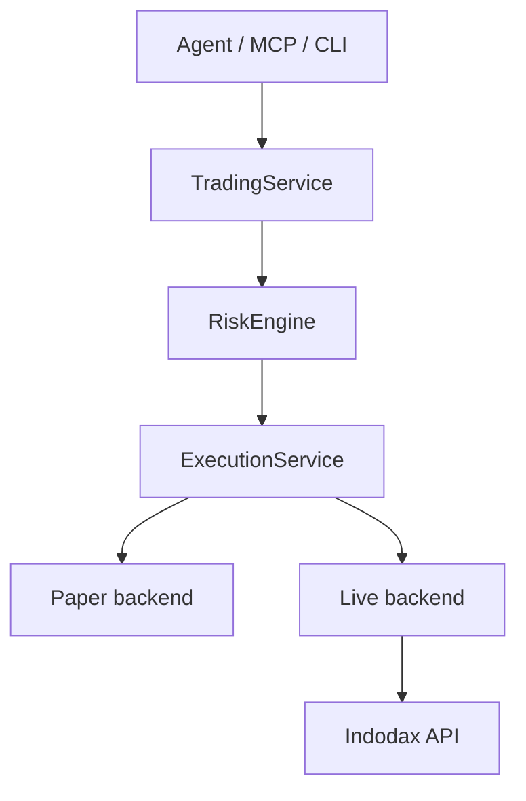

<h1 align="center">Indodax MCP</h1>

<p align="center">Modular trading infrastructure with MCP integration.</p>

Indodax MCP is a rebuild of
[indodax-cli](https://github.com/ibidathoillah/indodax-cli) by
ibidathoillah, rebuilt for high flexibility and extended features under the name
Indodax MCP. Usage is expanded for AI agents, humans, and developers.

Licensed under SSPL v1, copyright D1ZZY4. The original repository
license is preserved in `LICENSE_COPY/`.

## Quickstart

Prerequisites: stable Rust with `rustfmt` and `clippy` (see
`rust-toolchain.toml`).

```bash
cp .env.example .env
cargo build
scripts/check.sh
```

`scripts/check.sh` runs `cargo fmt`, `cargo check`, `cargo test`, and
`cargo clippy` for the workspace.

## Configuration

Copy `.env.example` to `.env` and fill in credentials for private API
access. Only these keys belong in `.env`:

```dotenv
INDODAX_API_KEY=your_api_key_here
INDODAX_API_SECRET=your_api_secret_here
# INDODAX_RATE_LIMIT=5
# INDODAX_WS_TOKEN=your_ws_token_here
```

Runtime mode files live in `config/` (`default.toml`,
`development.toml`, `paper.toml`, `live.toml.example`). Paper is the
default. Live never activates from credentials alone.

## Layout

* `crates/`: domain and infrastructure crates with explicit boundaries.
* `apps/`: thin binaries (`cli`, `mcp-server`, `mcp-http`, `daemon`).
* `tests/`, `docs/`, `config/`, `deploy/`, `examples/`, `scripts/`.

## Execution boundary



```text
Agent/MCP/CLI
→ TradingService
→ RiskEngine
→ ExecutionService
→ Paper | Live backend
→ Indodax API
```

No path from MCP, agent intent, or strategy directly to live order
placement. Withdrawal requires a separate `funding.withdraw` capability.

## Usage

CLI binary is named `indodax` and defaults to paper plus table output:

```bash
cargo run -p indodax-cli -- market ticker btc_idr
cargo run -p indodax-cli -- market ticker btc_idr --output json
cargo run -p indodax-cli -- risk limits
cargo run -p indodax-cli -- paper balances
```

Subcommands: `market`, `account`, `trading`, `portfolio`, `paper`,
`risk`, `alerts`, `system`, `auth`. Private commands need
`INDODAX_API_KEY` and `INDODAX_API_SECRET` in process env and fail with
a clean error when they are missing.

MCP over stdio:

```bash
cargo run -p indodax-mcp-server
```

MCP over HTTP (default port `8000`, override with `MCP_PORT`):

```bash
cargo run -p indodax-mcp-http
```

Both transports share one dispatch, so behavior is identical.

## MCP surface

58 tools across market, account, orders, trading, portfolio, risk,
paper, strategy, backtest, alerts, reconciliation, audit, system,
auth, funding, and websocket groups, plus 7 resources and 5 prompts.
See [MCP surface](docs/mcp/surface.md).

Read-only examples: `market_ticker`, `market_pairs`, `paper_balances`,
`risk_limits`, `system_capabilities`. Mutating paths go through
validation, risk review, and execution in that order.

## Modes

* `paper` (default, safe)
* `live` (explicit opt-in)
* `development`

Live mode never activates implicitly from credentials alone.

> [!WARNING]
> Live mode can move real funds. Keep paper as default, require explicit
> mode plus capability for live, and never enable `funding.withdraw`
> unless a separate grant is intended.

## Development

```bash
cargo fmt --all -- --check
cargo check --workspace --all-targets
cargo test --workspace --all-targets
cargo clippy --workspace --all-targets -- -D warnings
```

Keep each authored file at or under 350 lines (375 hard ceiling).
MCP handlers stay thin: deserialize, validate, call service, serialize.

## Docs

* [System overview](docs/architecture/overview.md)
* [Execution flow](docs/architecture/execution.md)
* [Completeness](docs/architecture/completeness.md)
* [MCP surface](docs/mcp/surface.md)
* [MCP tool implementation](docs/mcp/tools.md)
* [Trading modes](docs/trading/modes.md)
* [Risk policy](docs/risk/policy.md)
* [Operations runbook](docs/operations/runbook.md)
* [Migration v1 to v2](docs/migration/v1-to-v2.md)
* [Upstream sources](docs/references/sources.md)
* [ADR workspace](docs/adr/001-workspace.md)
* [ADR risk](docs/adr/002-risk.md)
* [ADR execution](docs/adr/003-execution.md)
* [ADR MCP](docs/adr/004-mcp.md)
* [ADR OAuth](docs/adr/005-oauth.md)
* [Security](SECURITY.md), [Contributing](CONTRIBUTING.md), [Changelog](CHANGELOG.md).
