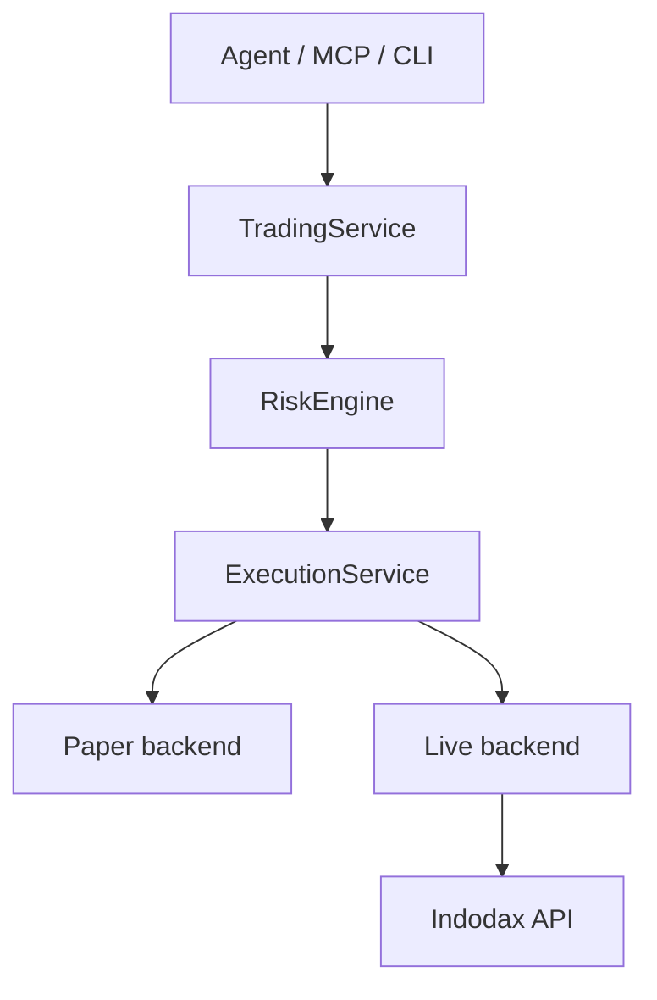
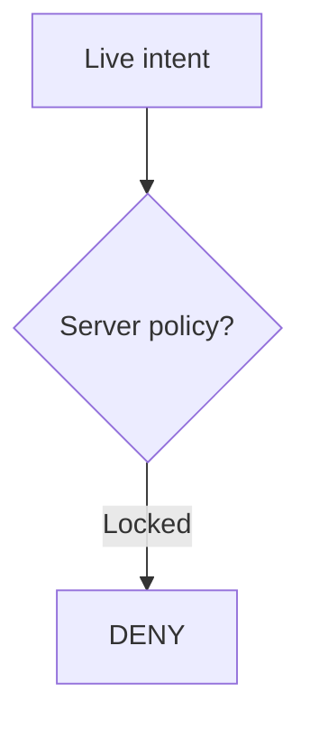

<h1 align="center">INDODAX MCP</h1>

Community MCP server and trading infrastructure for INDODAX, built for AI agents, CLI workflows, and operators.

> [!CAUTION]
> Unofficial community software. It is not affiliated with, endorsed by, or supported by INDODAX. Cryptocurrency trading can result in loss of funds.

> [!IMPORTANT]
> The current application policy is paper-only. A live execution adapter exists, but the composed server does not currently permit live order placement. Withdrawal is disabled by design.

Indodax MCP is a TypeScript/Bun rebuild of [indodax-cli](https://github.com/ibidathoillah/indodax-cli) by ibidathoillah. The original MIT license is preserved in [LICENSE_COPY](LICENSE_COPY/README.md). This repository is licensed under SSPL v1; see [LICENSE](LICENSE).

## Requirements

- Bun 1.4.2, matching the repository package manager
- PostgreSQL 17 when working with the database package and its integration path
- A supported INDODAX TAPI v2 key for authenticated read operations

The main MCP composition does not require a database to start because its current application state is in memory. PostgreSQL is part of the persistence layer and its integration tests, not yet the runtime source of truth.

## Install

~~~bash
cp .env.example .env
bun install
bun run check
~~~

CI currently runs format, lint, typecheck, test, and build.

## Quickstart

Public market reads and paper trading work without credentials:

~~~bash
bun apps/cli/src/main.ts market ticker btc_idr
bun apps/cli/src/main.ts paper status
bun apps/cli/src/main.ts risk limits
~~~

Run MCP over stdio:

~~~bash
bun apps/mcp-stdio/src/main.ts
~~~

Run MCP over Streamable HTTP:

~~~bash
bun apps/mcp-http/src/main.ts
~~~

The HTTP server binds to 127.0.0.1 and defaults to port 8000; override with MCP_PORT.

Both transports use the same server registry and handler set. The current SDK environment negotiates MCP protocol 2025-11-25.

## Configuration

The exchange credential contract is intentionally small:

~~~dotenv
INDODAX_API_KEY=your_api_key_here
INDODAX_API_SECRET=your_api_secret_here
# INDODAX_RATE_LIMIT=5
# INDODAX_WS_TOKEN=your_ws_token_here
~~~

Server configuration also supports DATABASE_URL, MCP_PORT, APP_ENV, TRADE_ENABLED, and WITHDRAW_ENABLED. See [.env.example](.env.example) and the [documentation index](docs/README.md).

Never commit real credentials. Rotate an exchange key immediately if it is exposed.

## Trading model

The supported execution model today is:

The live branch is intentionally closed:

The live backend is maintained behind the execution interface so it can be hardened and verified independently before any production enablement.

Withdrawal has no server-side grant path.

## MCP surface

The current server exposes 73 tools, 11 resources, and 5 prompts.

Tool areas include market data, account reads, order validation and paper execution, portfolio views, risk, strategies, backtests, alerts, reconciliation, audit, system status, funding reads, history, and WebSocket inspection.

See [MCP surface](docs/mcp/surface.md), [MCP implementation notes](docs/mcp/tools.md), and the [agent harness guide](docs/guides/agent-harness.md).

## Safety model

Paper execution is the default. Mutation tools use explicit metadata, a central auth and environment guard, plus handler-level checks. Risk evaluation is deterministic and fail-closed for kill switch, circuit breaker, reconciliation halt, mode/capability mismatch, stale state, limits, and other configured constraints.

For live trading, the application policy currently allows only paper mode, so APP_ENV=live does not enable order placement.

See [Risk policy](docs/risk/policy.md), [Trading modes](docs/trading/modes.md), and [Security](SECURITY.md).

## API integration

The implementation separates:

- Public REST at https://indodax.com
- TAPI v2 at https://api.indodax.com
- Market WebSocket at wss://ws3.indodax.com/ws/
- Private WebSocket at wss://pws.indodax.com/ws/?cf_ws_frame_ping_pong=true
- Legacy v1 signing only where a compatibility path still uses it

TAPI v2 uses the documented HMAC-SHA256 signing model, while legacy private API calls use HMAC-SHA512. See [API mapping](docs/api/mapping.md) and [source references](docs/references/sources.md).

## Development

~~~bash
bun run format:check
bun run lint
bunx turbo typecheck
bunx turbo test
bunx turbo build
bunx playwright test
~~~

For the combined repository gate:

~~~bash
bun run verify
~~~

Repository rules:

- Keep authored files at or under 350 lines; 375 is the hard ceiling.
- Use Decimal for financial quantities and avoid floating-point accounting.
- Keep MCP handlers thin.
- Keep generic MCP/core packages independent from INDODAX domain packages.
- Do not weaken a gate to make CI green.
- Measure and report line counts for authored files when making broad repository changes.

## Documentation

Start at the [documentation index](docs/README.md).

Key references:

- [Architecture overview](docs/architecture/overview.md)
- [Execution flow](docs/architecture/execution.md)
- [Completeness matrix](docs/architecture/completeness.md)
- [MCP surface](docs/mcp/surface.md)
- [API mapping](docs/api/mapping.md)
- [Risk policy](docs/risk/policy.md)
- [Trading modes](docs/trading/modes.md)
- [Operations runbook](docs/operations/runbook.md)
- [Agent harness guide](docs/guides/agent-harness.md)
- [Migration notes](docs/migration/rust-to-typescript.md)

Project policies:

- [Contributing](CONTRIBUTING.md)
- [Security](SECURITY.md)
- [Code of Conduct](CODE_OF_CONDUCT.md)
- [Changelog](CHANGELOG.md)
