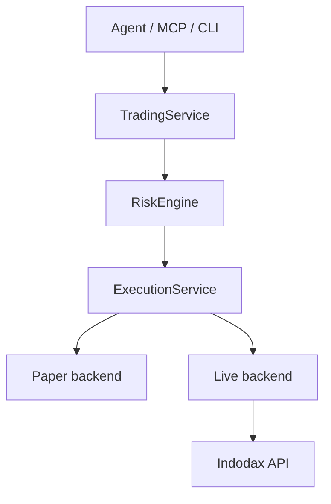
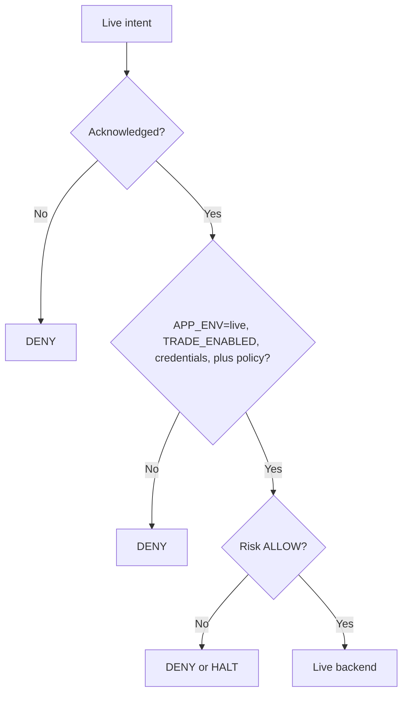

<h1 align="center">INDODAX MCP</h1>

Community MCP server and trading infrastructure for INDODAX, built for AI agents, CLI workflows, and operators.

> [!CAUTION]
> Unofficial community software. It is **not affiliated** with, endorsed by, or supported by INDODAX. Cryptocurrency trading **can result in loss of funds**.

> [!IMPORTANT]
> Live execution is gated by `APP_ENV=live` plus `TRADE_ENABLED=true`, credentials, explicit acknowledgement, and risk ALLOW. Paper is the default. Withdrawal is **disabled by design**.

## History

Indodax MCP is a **rebuild** of [indodax-cli](https://github.com/ibidathoillah/indodax-cli) by ibidathoillah, and has since been **expanded in features, uses, and scope**. The original MIT license is preserved in [LICENSE_COPY](LICENSE_COPY/README.md). This repository is licensed under **SSPL v1**; see [LICENSE](LICENSE). It now serves **developers**, **beginners**, **advanced users**, and **agent harnesses** through shared market, account, paper trading, risk, and operational tooling.

An agent harness can operate your account through the MCP surface, so **supervise your agent harness and do not trust it blindly**. Give it **clear instructions with full context**, and treat its proposals as suggestions until you have verified balances, risk verdicts, and reconciliation state.

The repository ships with **default safeguards that constrain agent harnesses**, including paper-default policy with APP_ENV-gated live, explicit capability metadata, auth and environment guards, deterministic risk review, and no server-side withdrawal path.

## Requirements

- Bun 1.4.2. The published binaries carry a `#!/usr/bin/env bun` shebang, so Bun
  is required whether you use `bunx`, `npx`, or a global install.
- Nothing else. The server runs with no clone, no database, and no credentials.
- Optional: PostgreSQL 17 when you want the persistence mirrors attached.
- Optional: an INDODAX TAPI v2 key for authenticated reads and any live path.

The main MCP composition does not require a database to start because its
current application state is in memory. PostgreSQL is part of the persistence
layer and its integration tests, not yet the runtime source of truth.

## Install

All 39 packages publish to npm under the `@indodax-mcp` scope, so running the
server needs no clone. `bunx` and `npx` both work. **Bun is required at
runtime**: the published binaries carry a `#!/usr/bin/env bun` shebang.

One command, no install step:

~~~bash
bunx -y @indodax-mcp/indodax-mcp
~~~

That starts the MCP server on stdio, ready for an MCP host. To install it
permanently instead:

~~~bash
bun add -g @indodax-mcp/indodax-mcp @indodax-mcp/cli
~~~

### MCP client configuration

For a stdio client such as OpenCode or Claude Desktop, one entry is enough:

~~~json
{
  "mcp": {
    "indodax-mcp": {
      "command": "bunx",
      "args": ["-y", "@indodax-mcp/indodax-mcp"],
      "env": {
        "INDODAX_API_KEY": "",
        "INDODAX_API_SECRET": ""
      }
    }
  }
}
~~~

Leave the credential values empty to run read-only against the public API. An
MCP client cannot inject environment into a process it did not launch, so
credentials must be set in the client `env` block or exported into whatever
starts the server.

### Published packages

| Package | Binary | Purpose |
| --- | --- | --- |
| `@indodax-mcp/indodax-mcp` | `indodax-mcp` | MCP server, stdio |
| `@indodax-mcp/mcp-http` | `indodax-mcp-http` | MCP server, Streamable HTTP |
| `@indodax-mcp/cli` | `indodax` | terminal companion |
| `@indodax-mcp/daemon` | `indodax-daemon` | market refresh and snapshots |
| `@indodax-mcp/mcp-workbench` | none | browser workbench, static assets |

The 34 libraries publish per-module output with type declarations. The five
apps publish a single bundled `dist/index.js`, because each one is a binary and
must run without a `node_modules` tree.

## Quickstart

Public market reads and paper trading work without credentials:

~~~bash
indodax market ticker btc_idr
indodax paper status
indodax risk limits
~~~

Without a global install, substitute `bunx -y @indodax-mcp/cli`.

Run MCP over Streamable HTTP instead of stdio:

~~~bash
bunx -y @indodax-mcp/mcp-http
~~~

The HTTP server binds to 127.0.0.1 and defaults to port 8000; override with
`MCP_HOST` and `MCP_PORT`. Compose sets `MCP_HOST=0.0.0.0` so the published host
port can reach the container gateway.

Both transports use the same server registry and handler set. The current SDK
environment negotiates MCP protocol 2025-11-25.

## Run from source

To develop against the working tree rather than the published packages:

~~~bash
git clone https://github.com/D1ZZY4/indodax-mcp.git
cd indodax-mcp
cp .env.example .env
bun install
bun run check

bun apps/cli/src/main.ts market ticker btc_idr
bun apps/mcp-stdio/src/main.ts
bun apps/mcp-http/src/main.ts
~~~

CI currently runs format, lint, typecheck, test, and build.

## Configuration

The exchange credential contract is intentionally small:

~~~dotenv
INDODAX_API_KEY=your_api_key_here
INDODAX_API_SECRET=your_api_secret_here
# INDODAX_RATE_LIMIT=5
# INDODAX_WS_TOKEN=your_ws_token_here
~~~

Server configuration also supports DATABASE_URL, MCP_HOST, MCP_PORT, APP_ENV, TRADE_ENABLED, and WITHDRAW_ENABLED. See [.env.example](.env.example) and the [documentation index](docs/README.md).

Never commit real credentials. **Rotate an exchange key immediately** if it is exposed.

## Trading model

The supported execution model today is:

The live branch is gated, not closed:

The live backend shares the execution interface. Paper stays the default; live needs credentials, acknowledgement, risk approval, and reconciliation on ambiguous outcomes.

Withdrawal has **no server-side grant path**.

## MCP surface

The current server exposes 91 tools, 12 resources, and 5 prompts.

Tool areas include market data, account reads, order validation and paper execution, stop orders emulated server-side, portfolio views, risk, strategies, backtests, alerts, reconciliation, audit, system status, funding reads, history, private channel, and WebSocket inspection.

See [MCP surface](docs/mcp/surface.md), [MCP implementation notes](docs/mcp/tools.md), and the [agent harness guide](docs/guides/agent-harness.md).

## Safety model

Paper execution is the default. Mutation tools use explicit metadata, a central auth and environment guard, plus handler-level checks. Risk evaluation is **deterministic** and **fail-closed** for kill switch, circuit breaker, reconciliation halt, mode/capability mismatch, stale state, limits, and other configured constraints.

For live trading, set `APP_ENV=live` plus `TRADE_ENABLED=true` with credentials, explicit acknowledgement, and risk ALLOW. Paper stays the default when live is not fully gated.

See [Risk policy](docs/risk/policy.md), [Trading modes](docs/trading/modes.md), and [Security](SECURITY.md).

## API integration

The implementation separates:

- Public REST at https://indodax.com
- TAPI v2 at https://api.indodax.com
- Market WebSocket at wss://ws3.indodax.com/ws/
- Private WebSocket at wss://pws.indodax.com/ws/?cf_ws_frame_ping_pong=true
- Legacy v1 signing only where a compatibility path still uses it

TAPI v2 uses the documented HMAC-SHA256 signing model, while legacy private API calls use HMAC-SHA512. See [API mapping](docs/api/mapping.md) and [source references](docs/references/sources.md).

## Development

~~~bash
bun run format:check
bun run lint
bunx turbo typecheck
bunx turbo test
bunx turbo build
bunx playwright test
~~~

For the combined repository gate:

~~~bash
bun run verify
~~~

Repository rules:

- Keep authored files at or under **350 lines**; **375 is the hard ceiling**.
- Use Decimal for financial quantities and avoid floating-point accounting.
- Keep MCP handlers thin.
- Keep generic MCP/core packages independent from INDODAX domain packages.
- Do not weaken a gate to make CI green.
- Measure and report line counts for authored files when making broad repository changes.

## Documentation

Start at the [documentation index](docs/README.md).

Key references:

- [Architecture overview](docs/architecture/overview.md)
- [Execution flow](docs/architecture/execution.md)
- [Completeness matrix](docs/architecture/completeness.md)
- [MCP surface](docs/mcp/surface.md)
- [API mapping](docs/api/mapping.md)
- [Risk policy](docs/risk/policy.md)
- [Trading modes](docs/trading/modes.md)
- [Operations runbook](docs/operations/runbook.md)
- [Agent harness guide](docs/guides/agent-harness.md)
- [Migration notes](docs/migration/rust-to-typescript.md)

Project policies:

- [Contributing](CONTRIBUTING.md)
- [Security](SECURITY.md)
- [Code of Conduct](CODE_OF_CONDUCT.md)
- [Changelog](CHANGELOG.md)
