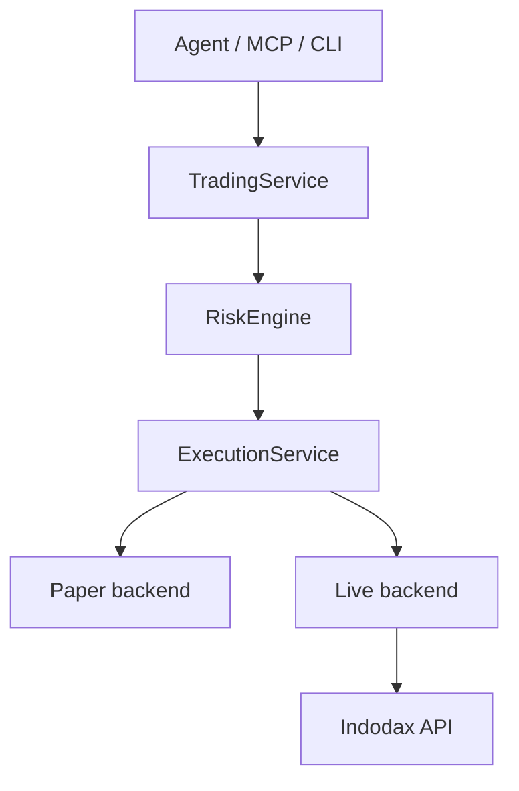

<h1 align="center">Indodax MCP</h1>

<p align="center">Trading infrastructure with MCP integration.</p>

Indodax MCP is a rebuild of
[indodax-cli](https://github.com/ibidathoillah/indodax-cli) by
ibidathoillah, rebuilt for high flexibility and extended features under the name
Indodax MCP. Usage is expanded for AI agents, humans, and developers.

Licensed under SSPL v1, copyright D1ZZY4. The original repository
license is preserved in `LICENSE_COPY/`.

## Quickstart

Prerequisites: Bun 1.4.2 or newer, plus a local PostgreSQL for
persistent storage (or `DATABASE_URL` pointing at one).

```bash
cp .env.example .env
bun install
bun run check
```

`scripts/check.sh` runs install, format check, lint, typecheck,
tests, and build through Turborepo.

## Configuration

Copy `.env.example` to `.env` and fill in credentials for private API
access. Only these keys belong in `.env`:

```dotenv
INDODAX_API_KEY=your_api_key_here
INDODAX_API_SECRET=your_api_secret_here
# INDODAX_RATE_LIMIT=5
# INDODAX_WS_TOKEN=your_ws_token_here
```

Runtime mode files live in `config/` (`default.toml`,
`development.toml`, `paper.toml`, `live.toml.example`). Paper is the
default. Live never activates from credentials alone.

## Layout

* `packages/`: generic core, MCP infrastructure, exchange, and domain packages.
* `apps/`: runnable binaries (`mcp-stdio`, `mcp-http`, `daemon`, `cli`, `mcp-workbench`).
* `tests/`, `docs/`, `config/`, `migrations/`, `examples/`, `scripts/`, `deploy/`.

## Execution boundary



```text
Agent/MCP/CLI
→ TradingService
→ RiskEngine
→ ExecutionService
→ Paper | Live backend
→ Indodax API
```

No path from MCP, agent intent, strategy, CLI, or Workbench directly
to live order placement. Withdrawal requires a separate grant this
server never holds.

## Usage

CLI defaults to paper:

```bash
bun apps/cli/src/main.ts market ticker btc_idr
bun apps/cli/src/main.ts paper status
bun apps/cli/src/main.ts risk limits
```

MCP over stdio:

```bash
bun apps/mcp-stdio/src/main.ts
```

MCP over Streamable HTTP (default port `8000`, override with `MCP_PORT`):

```bash
bun apps/mcp-http/src/main.ts
```

Both transports share one registry and dispatch, so behavior is identical.

## MCP surface

73 tools across market, account, orders, portfolio, risk, paper,
strategy, backtest, alerts, reconciliation, audit, system, funding,
history, operations, and WebSocket groups, plus 11 resources and
5 prompts. See [MCP surface](docs/mcp/surface.md).

Tool names use the `indodax_` prefix, for example `indodax_ticker`,
`indodax_account`, `indodax_create_order`, `indodax_reconcile_order`.

## Modes

* `paper` (default, safe)
* `live` (explicit opt-in)
* `development`

Live mode never activates implicitly from credentials alone.

> [!WARNING]
> Live mode can move real funds. Keep paper as default, require explicit
> mode plus capability for live, and withdrawal stays locked.

## Development

```bash
bun run format:check
bun run lint
bunx turbo typecheck
bunx turbo test
bunx turbo build
```

Keep each authored file at or under 350 lines (375 hard ceiling).
MCP handlers stay thin: validate, guard, call service, serialize.

## Docs

* [System overview](docs/architecture/overview.md)
* [Execution flow](docs/architecture/execution.md)
* [Completeness](docs/architecture/completeness.md)
* [MCP surface](docs/mcp/surface.md)
* [MCP tool implementation](docs/mcp/tools.md)
* [API mapping](docs/api/mapping.md)
* [Trading modes](docs/trading/modes.md)
* [Risk policy](docs/risk/policy.md)
* [Operations runbook](docs/operations/runbook.md)
* [Migration v1 to v2](docs/migration/v1-to-v2.md)
* [Upstream sources](docs/references/sources.md)
* [Security](SECURITY.md), [Contributing](CONTRIBUTING.md), [Changelog](CHANGELOG.md).
