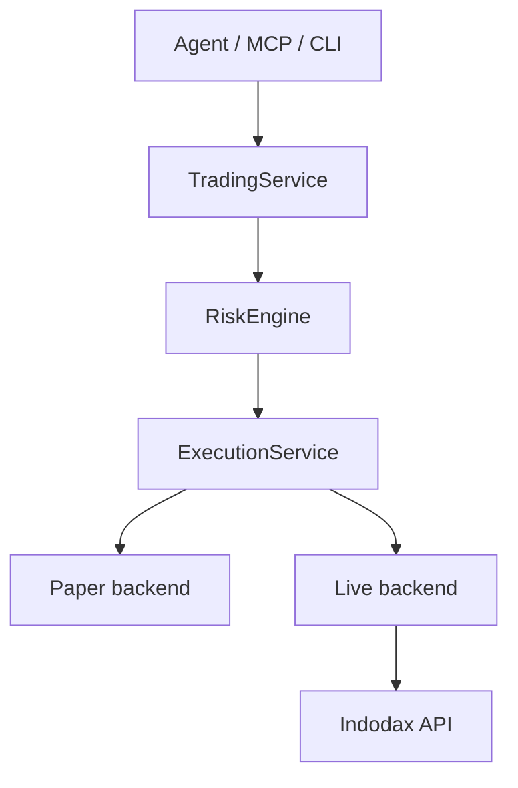

<h1 align="center">Indodax MCP</h1>

<p align="center">Community MCP server for the Indodax exchange: live market data, paper trading, and risk-guarded order flow for AI agents.</p>

> [!CAUTION]
> Unofficial community project. Not affiliated with, endorsed, or supported by Indodax. Trading cryptocurrency carries risk of loss. Paper mode is the default; live mode moves real funds and requires explicit opt-in plus exchange-side key permissions and IP whitelisting.

Indodax MCP is a rebuild of [indodax-cli](https://github.com/ibidathoillah/indodax-cli) by ibidathoillah, extended for AI agents, CLI users, and operators. The original MIT license is preserved in [LICENSE_COPY](LICENSE_COPY/README.md). This project itself is SSPL v1, copyright D1ZZY4, see [LICENSE](LICENSE).

## Install

Prerequisites: Bun 1.4.2 or newer. PostgreSQL 17 for persistent storage (or a `DATABASE_URL` pointing at one; dev and tests use embedded PostgreSQL binaries).

```bash
cp .env.example .env
bun install
bun run check
```

`scripts/check.sh` runs install, format check, lint, typecheck, tests, and build through Turborepo.

## Quickstart

No credentials needed for market reads and paper trading:

```bash
bun apps/cli/src/main.ts market ticker btc_idr
bun apps/cli/src/main.ts paper status
bun apps/cli/src/main.ts risk limits
```

MCP over stdio (used by OpenCode and other MCP hosts):

```bash
bun apps/mcp-stdio/src/main.ts
```

MCP over Streamable HTTP (default port `8000`, override with `MCP_PORT`):

```bash
bun apps/mcp-http/src/main.ts
```

Both transports share one registry and dispatch, so behavior is identical. Protocol `2025-11-25`.

## What it exposes

73 tools with the `indodax_` prefix (for example `indodax_ticker`, `indodax_account`, `indodax_create_order`), plus 11 resources and 5 prompts. Full surface: [MCP surface](docs/mcp/surface.md). Tool implementation notes: [MCP tool implementation](docs/mcp/tools.md).

Groups: market (10), account plus history, orders (validate, propose, create, cancel), portfolio, risk, paper (9), strategy plus backtest, alerts, reconciliation, audit, system, funding reads, history, operations, WebSocket.

## Configuration

Copy [.env.example](.env.example) to `.env`. Only these keys belong there:

```dotenv
INDODAX_API_KEY=your_api_key_here
INDODAX_API_SECRET=your_api_secret_here
# INDODAX_RATE_LIMIT=5
# INDODAX_WS_TOKEN=your_ws_token_here
# APP_ENV=paper
# TRADE_ENABLED=true
```

> [!IMPORTANT]
> Never commit real secrets. `.env` is git-ignored; only `.env.example` is tracked.

Runtime mode files live in [config](config/default.toml) (`default.toml`, `development.toml`, `paper.toml`, `live.toml.example`). Paper is the default.

## Modes and safety

* `paper` (default): virtual funds, no exchange contact for orders. Cannot spend real money.
* `live` (explicit opt-in): requires `APP_ENV=live` plus `TRADE_ENABLED=true` plus a TAPI v2 key with trading permission plus whitelisted client IP. Every live order still passes risk review and needs `acknowledged: true` per call.
* Withdrawal is always denied by this server, regardless of mode.



```text
Agent/MCP/CLI
→ TradingService
→ RiskEngine
→ ExecutionService
→ Paper | Live backend
→ Indodax API
```

No path from MCP, agent intent, strategy, CLI, or Workbench reaches live placement without passing validation, risk review, capability, and server policy. See [Trading modes](docs/trading/modes.md) and [Risk policy](docs/risk/policy.md).

> [!WARNING]
> Minimum order sizes are enforced by the exchange (Rp10.000 on IDR pairs, 1 USDT on USDT pairs, at time of writing). Orders below minimum are rejected before anything is sent.

## Usage

CLI (paper by default, exits non-zero with usage errors):

```bash
bun apps/cli/src/main.ts market ticker btc_idr --output json
bun apps/cli/src/main.ts account balances
bun apps/cli/src/main.ts paper balances
bun apps/cli/src/main.ts system capabilities
```

Agent path over MCP (validate, then propose, then place into paper):

1. `indodax_validate_order` returns the risk verdict. Nothing is executed.
2. `indodax_propose_order` returns a proposal id plus verdict. Still nothing executed.
3. `indodax_create_order` executes into paper by default. Live stays denied unless explicitly enabled as above.

Response envelope is `{ status: "ok", data, fetchedAt }` on success and `{ status: "error", code, message, retryable, operationId }` with `isError: true` on failure. Branch on `code`, retry only when `retryable` is true. Agent playbook: [Agent harness guide](docs/guides/agent-harness.md).

## Development

```bash
bun run format:check
bun run lint
bunx turbo typecheck
bunx turbo test
bunx playwright test
bunx turbo build
```

Rules: keep each authored file at or under 350 lines (375 hard ceiling). MCP handlers stay thin: validate, guard, call service, serialize. Money is `Decimal` from parse time, never float. Fix the underlying problem; never weaken a gate to turn red green. Contributor rules: [Contributing](CONTRIBUTING.md). Security policy: [Security](SECURITY.md).

## Docs

* [Beginner guide](docs/guides/beginner.md)
* [Advanced guide](docs/guides/advanced.md)
* [Agent harness guide](docs/guides/agent-harness.md)
* [Developer guide](docs/guides/developer.md)
* [System overview](docs/architecture/overview.md)
* [Execution flow](docs/architecture/execution.md)
* [Completeness](docs/architecture/completeness.md)
* [MCP surface](docs/mcp/surface.md)
* [MCP tool implementation](docs/mcp/tools.md)
* [API mapping](docs/api/mapping.md)
* [Trading modes](docs/trading/modes.md)
* [Risk policy](docs/risk/policy.md)
* [Operations runbook](docs/operations/runbook.md)
* [Migration v1 to v2](docs/migration/v1-to-v2.md)
* [Upstream sources](docs/references/sources.md)
* [Security](SECURITY.md), [Contributing](CONTRIBUTING.md), [Changelog](CHANGELOG.md)
