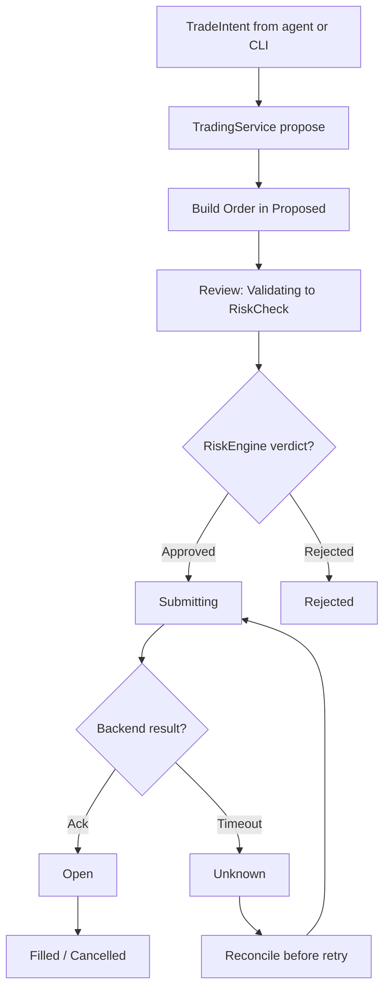
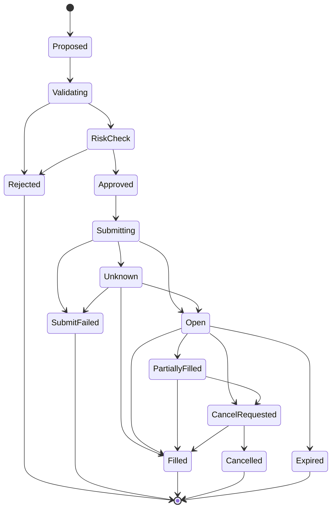

# Execution flow

1. Agent or CLI produces a `TradeIntent`.
2. `TradingService::propose` validates shape and records audit.
3. `TradingService::to_order` builds a typed `Order` in `Proposed`.
4. `TradingService::review` moves `Proposed → Validating → RiskCheck`,
   evaluates `RiskEngine`, then `Approved → Submitting` or `Rejected`.
5. `ExecutionService::execute` requires an approving `RiskDecision`
   and calls exactly one backend (`paper` or `live`).
6. Order machine records `Open → Filled/Cancelled/Unknown`.
7. Unknown outcomes (timeout) trigger reconciliation before retry.
