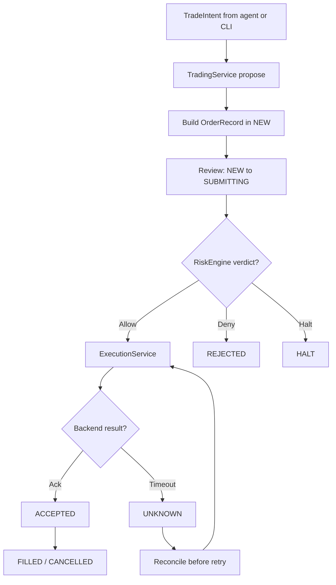
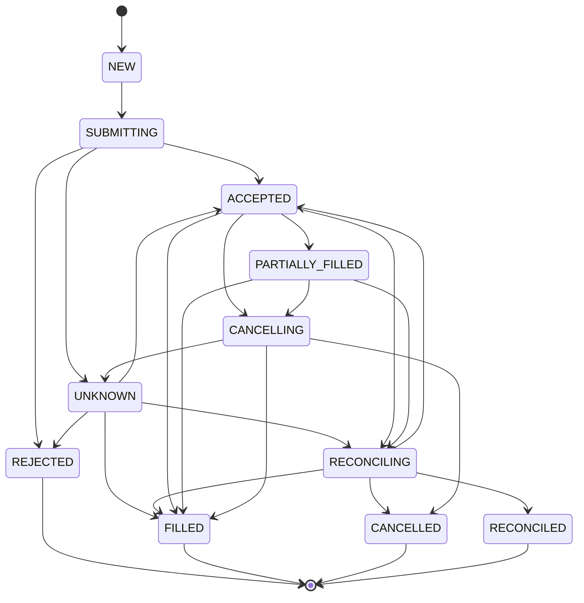

# Execution flow

The repository uses one execution contract for paper and live backends. The supported application mode today is paper.

## Runtime flow

Paper order placement follows the full intent, proposal, risk review, and execution path.

## Order lifecycle

Canonical order states live in @indodax-mcp/indodax-orders.

## Live execution boundary

LiveExecutor implements the current TAPI v2 order and cancel adapters. The main application still uses paperOnlyPolicy(), so the composed MCP server denies live placement.

The generic transport retry helper is method-agnostic. It retries HTTP 429, 5xx, and timeout conditions, including state-changing POST requests. That means the retry helper alone does not provide live order idempotency safety.

## Unknown outcomes

A timeout or dropped connection is not evidence that the exchange rejected an order.

The required production sequence is:

1. preserve the client order identifier;
2. mark the operation as unknown;
3. reconcile against exchange order and trade state;
4. decide whether another request is safe.

The current reconciliation package contains comparison primitives, but the MCP reconciliation tools are not yet a complete exchange-state reconciliation workflow.

## Safety invariant

ExecutionService requires an ALLOW risk decision before calling a backend. This is necessary but not sufficient for production live execution; the surrounding application still needs complete context, durable state, reconciliation, and idempotency controls.
