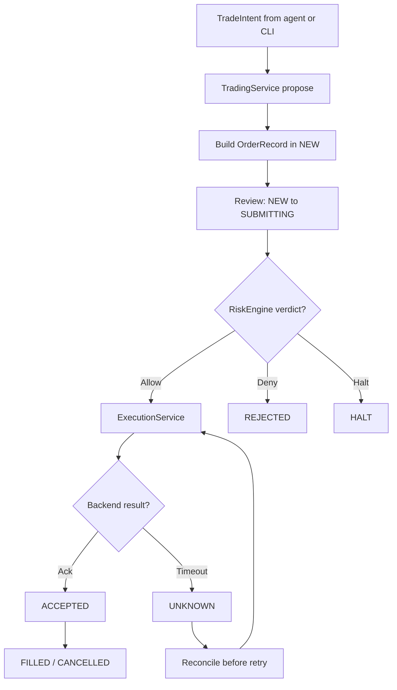
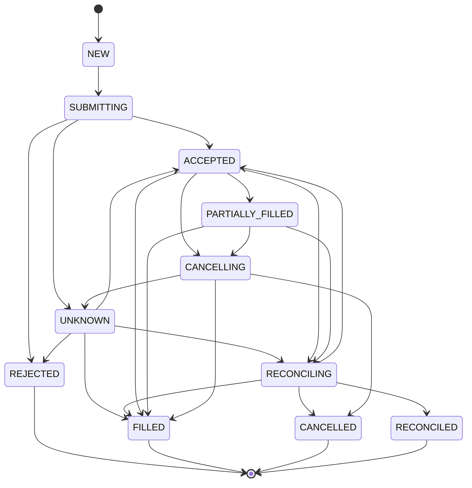

# Execution flow

1. Agent or CLI produces a `TradeIntent`.
2. `TradingService.propose` validates shape and records audit.
3. `TradingService.toOrder` builds a typed `OrderRecord` in `NEW`.
4. `TradingService.review` moves `NEW → SUBMITTING`, evaluates the
   risk engine, then `ACCEPTED` or `REJECTED`.
5. `ExecutionService.execute` requires an approving `RiskDecision`
   and calls exactly one backend (`paper` or `live`).
6. Order machine records `Open → Filled/Cancelled/Unknown`.
7. Unknown outcomes (timeout) trigger reconciliation before retry.
