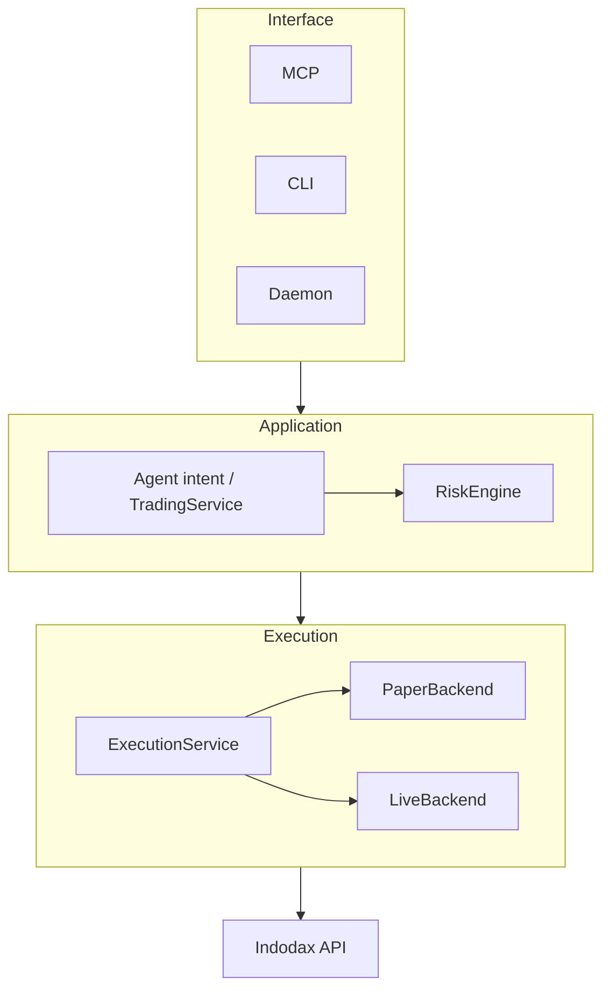

# Architecture

## Direction



```text
MCP / CLI / Daemon
→ Agent intent / TradingService
→ RiskEngine
→ ExecutionService
→ PaperBackend | LiveBackend
→ Indodax API
```

Every order passes validation, risk review, and execution in that
order. Skipping a stage is a bug, not an optimization.

## Boundaries

* `indodax-core`: types, errors, money, orders, risk verdicts.
* `indodax-auth`, `indodax-transport`, `indodax-rate-limit`: signing,
  HTTP retry, token bucket. No business logic.
* `indodax-api`: typed V1/V2 REST calls only.
* `indodax-market`, `indodax-account`: normalized reads plus caches.
* `indodax-order`: lifecycle state machine plus reconciliation.
* `indodax-risk`: deterministic policy. Depends on nothing outside core.
* `indodax-execution`: backend trait plus the risk-guarded service.
* `indodax-paper`: simulation behind the same execution contracts.
* `indodax-trading`: intent validation and risk review orchestration.
* `indodax-agent`: external AI boundary. Intents and proposals only.
* `indodax-mcp`: thin tools over services. See [MCP surface](../mcp/surface.md).
* `indodax-gateway`, `indodax-oauth`: HTTP transport isolation.

Withdrawal uses `WITHDRAW` capability. Trading permission never
implies it.
