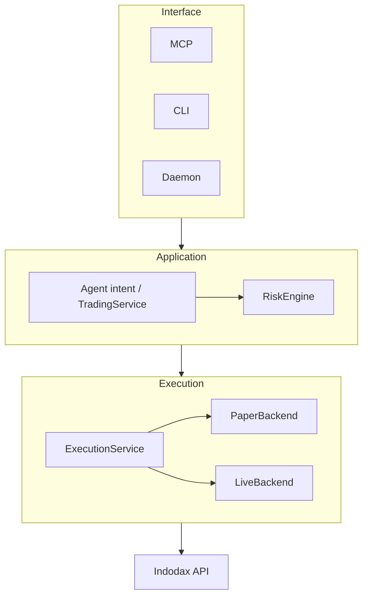

<h1 align="center">Architecture overview</h1>

The repository separates exchange protocol handling, financial domain logic, application orchestration, and MCP/CLI interfaces.

## Runtime direction

The main composition defaults to paper execution with in-memory application state. With `APP_ENV=live` plus credentials, acknowledgement, and risk approval, the live backend executes through the same risk-guarded path.

## Package layers

### Generic foundation

- `@d1zzy4-jethools/core`: domain types, Decimal helpers, symbols, order validation, capabilities, execution modes, and risk types.
- `@d1zzy4-jethools/errors`: typed application and exchange errors.
- `@d1zzy4-jethools/mcp-core`: MCP SDK server construction and dispatch.
- `@d1zzy4-jethools/mcp-contracts`: metadata schemas for tools, resources, and prompts.
- `@d1zzy4-jethools/mcp-registry`: registry for MCP surface definitions.
- `@d1zzy4-jethools/mcp-runtime`: stdio and HTTP transport adapters.
- `@d1zzy4-jethools/mcp-testing`: in-memory, stdio, and HTTP test harnesses.
- `@d1zzy4-jethools/transport`: HTTP retry and rate-limiting primitives.
- `@d1zzy4-jethools/storage`: repository interfaces and in-memory implementation.
- `@d1zzy4-jethools/db`: PostgreSQL schema, migrations, and Drizzle repositories.

### Exchange and domain

- `@d1zzy4-jethools/indodax-auth`: TAPI v2 and legacy signing plus private WebSocket token signing.
- `@d1zzy4-jethools/indodax-client`: public REST adapter.
- `@d1zzy4-jethools/indodax-market`: normalized market access and cache.
- `@d1zzy4-jethools/indodax-account`: authenticated account and history reads.
- `@d1zzy4-jethools/indodax-orders`: order record and lifecycle state machine.
- `@d1zzy4-jethools/indodax-reconciliation`: local versus exchange reconciliation primitives.
- `@d1zzy4-jethools/indodax-risk`: deterministic risk engine.
- `@d1zzy4-jethools/indodax-execution`: paper/live execution interface and live adapter.
- `@d1zzy4-jethools/indodax-paper`: paper ledger and simulator.
- `@d1zzy4-jethools/indodax-trading`: trade intent, proposal, validation, and risk review.
- `@d1zzy4-jethools/indodax-portfolio`: portfolio calculations.
- `@d1zzy4-jethools/indodax-strategy`: signal generation.
- `@d1zzy4-jethools/indodax-backtest`: deterministic replay and reports.
- `@d1zzy4-jethools/indodax-alerts`: in-memory alert store and condition evaluation.
- `@d1zzy4-jethools/indodax-audit`: in-memory audit trail.
- `@d1zzy4-jethools/indodax-deadman`: Deadman state machine.
- `@d1zzy4-jethools/indodax-websocket`: market/private socket protocol and managed connections.

### Application and operations

- `@d1zzy4-jethools/mcp-app`: application composition, tools, resources, and prompts.
- `@d1zzy4-jethools/observability`: health and counters.
- `@d1zzy4-jethools/events`: typed event bus.
- `@d1zzy4-jethools/scheduler`: interval jobs and shutdown controls.
- `@d1zzy4-jethools/logging`: structured logging.
- `@d1zzy4-jethools/config`: typed environment parsing.
- `@d1zzy4-jethools/secrets`: secret wrappers.

The application package is composed by the CLI, stdio server, HTTP gateway, daemon, and workbench.

## Boundary rules

- Generic infrastructure does not depend on INDODAX-specific packages.
- Exchange protocol details stay in adapters.
- Strategy code does not place orders.
- MCP handlers do not sign requests or implement exchange protocol.
- Financial math uses Decimal.
- Database access belongs behind repositories.

When code violates these rules, **update the boundary** rather than adding another exception.

## Current integration limits

Persistence exists as a database package but is not the source of truth for the current application composition. The MCP reconciliation surface is also not yet a complete exchange-state reconciliation workflow.

See [Completeness](completeness.md) for the current implementation status.
