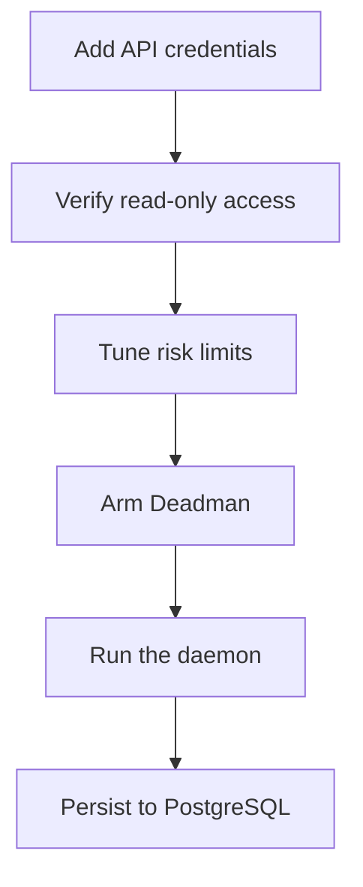

# Advanced guide

For operators who understand the beginner path and want live reads,
tighter risk, automation, and self-hosting.



## 1. Credentials and read-only verification

Add `INDODAX_API_KEY` and `INDODAX_API_SECRET` to `.env`. TAPI v2
needs a dedicated v2 key with the client IP whitelisted.

```bash
bun apps/cli/src/main.ts account info
bun apps/cli/src/main.ts account balances
```

If the exchange answers `-2015`, the key works but the IP grant is
missing. Fix it on the exchange dashboard, never in code.

## 2. Risk tuning

Defaults live in `defaultRiskLimits`: 10,000,000 IDR max order,
10,000 IDR minimum, 100,000,000 max position, 5,000,000 daily loss,
5 second cooldown, 60 second market staleness. Change them in the
composition root for your deployment, then re-run the risk tests.
Every denial carries a reason code; alert on `HALT`, review `DENY`.

## 3. Deadman Switch

Arm before any autonomous live session:

1. `indodax_deadman_arm` with pairs and `countdownMs`.
2. Refresh on a timer shorter than the countdown.
3. Watch `indodax_deadman_status`. `STALE` or `EXPIRED` halts new
   live trading until an operator clears it.

Paper never calls the exchange Deadman endpoint.

## 4. Daemon operations

```bash
bun apps/daemon/src/main.ts
```

Startup reconciles paper state, warms the account when credentials
exist, then runs market refresh every 30 seconds and snapshots every
60 seconds. `SIGINT` or `SIGTERM` flushes state and audit before exit.

## 5. PostgreSQL

Set `DATABASE_URL` and apply migrations:

```bash
bun --filter @indodax-mcp/db db:migrate
```

Compose ships Postgres 17 plus the HTTP gateway. Point production at
a managed instance with the same schema.

## 6. Backtests before strategies

Replay closes with `indodax_backtest_run`, compare runs with
`indodax_backtest_compare`, and read the journal with
`indodax_backtest_get`. Backtests never imply live profitability.

Next: [Agent harness guide](agent-harness.md).
