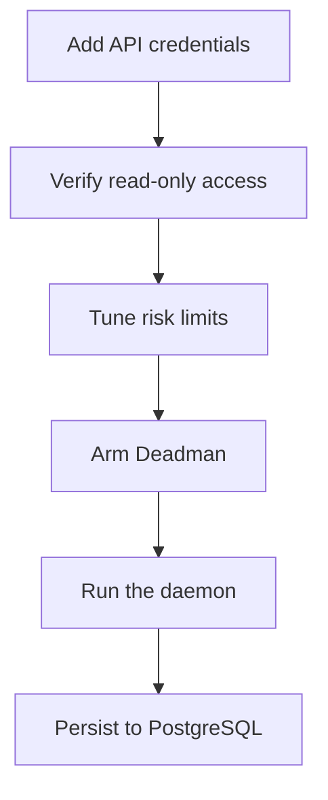

<h1 align="center">Advanced guide</h1>

For operators who need authenticated reads, paper automation, and a clear path toward future live readiness.

## 1. Authenticated reads

Add INDODAX_API_KEY and INDODAX_API_SECRET to .env.

~~~bash
bun apps/cli/src/main.ts account info
bun apps/cli/src/main.ts account balances
~~~

Use a dedicated TAPI v2 key with the appropriate exchange-side IP restrictions.

Treat authentication or IP errors as **exchange configuration signals** until the signing and endpoint path has been independently verified.

## 2. Application risk

Current defaults from defaultRiskLimits():

| Limit | Default |
| --- | ---: |
| Maximum order notional | 10,000,000 |
| Minimum order notional | 10,000 |
| Maximum position notional | 100,000,000 |
| Maximum daily loss | 5,000,000 |
| Maximum trade count | 100 |
| Order cooldown | 5,000 ms |
| Maximum market age | 60,000 ms |
| Maximum account age | 120,000 ms |

These are application limits, not exchange limits.

Several MCP callers resolve market freshness from a live ticker read and daily PnL from realized paper fills. The risk engine is deterministic, but a market read can still fail offline, in which case the staleness check is skipped rather than failed.

## 3. Deadman

The Deadman package implements its own state machine and tool surface. DISARMED means no heartbeat protection and still allows trading. Arm it when heartbeat protection is wanted; a stale or expired heartbeat then halts trading. With `DATABASE_URL` set, the armed state mirrors to Postgres and survives restarts; without it, a restart disarms silently, so check `indodax_deadman_status` (or `persistence` in `indodax_runtime_status`) after every boot.

## 4. Daemon

~~~bash
bun apps/daemon/src/main.ts
~~~

The current daemon refreshes market data, reports paper-order fillability against live prices, records snapshots, and shuts down cleanly on SIGINT or SIGTERM.

This is operational scaffolding, not a durable live trading engine.

## 5. PostgreSQL

Set DATABASE_URL when working with the database package:

~~~bash
bun --filter @d1zzy4-jethools/db db:migrate
~~~

The current main composition does not use PostgreSQL as its runtime source of truth.

## 6. Backtests

Run deterministic strategy replays with indodax_backtest_run, compare runs with indodax_backtest_compare, and inspect results with indodax_backtest_get.

Current backtest results are stored in process memory. They are **not durable historical records and do not demonstrate profitability**.

## 7. Live operation

Live placement runs only with `APP_ENV=live`, credentials, acknowledgement, and risk ALLOW. Keep proving durable state, authoritative risk context, exchange reconciliation, idempotent order handling, private WebSocket handling, Deadman lifecycle, and audit persistence as the live surface grows.
