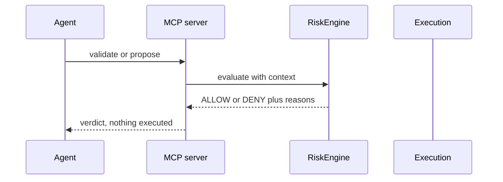

<h1 align="center">Agent harness guide</h1>

How an AI agent should operate the current Indodax MCP surface without treating documentation as execution authority.

## 1. Discover before acting

Start with indodax_health, indodax_system_capabilities, and indodax_config_status.

The current capability response should be treated as the **active server policy**. Live order placement stays gated; treat a `trade.place: false` capability as a closed gate, not a missing tool.

## 2. Read before mutation

Use indodax_ticker for one pair, indodax_tickers_all for scans, and indodax_orderbook for spread and depth.

Use indodax_account and indodax_balances for authenticated reads.

Use indodax_order_history and indodax_trade_history for the current v2 history endpoints.

## 3. Use the paper workflow

For paper execution:

1. indodax_validate_order for risk-only validation.
2. indodax_propose_order for a proposal and correlation id.
3. indodax_create_order or indodax_paper_order for paper execution.
4. indodax_paper_fill or indodax_paper_cancel for the next paper action.

**A proposal is not an execution receipt.**

## 4. Live calls

Paper is the default. Live placement needs `APP_ENV=live` plus `TRADE_ENABLED=true`, credentials, `acknowledged: true`, risk ALLOW, IP whitelist, and funds above minimums.

**Never use a live mutation as a verification probe.**

For any future live deployment, require acknowledgement, risk approval, exchange permissions, durable state, client-order idempotency, and reconciliation.

## 5. Handle responses by code

Success:

~~~json
{
  "status": "ok",
  "data": {},
  "fetchedAt": "..."
}
~~~

Failure:

~~~json
{
  "status": "error",
  "code": "...",
  "message": "...",
  "retryable": false
}
~~~

**Branch on code and `retryable`, not message text.**

An ambiguous state-changing result must be treated as **unknown**. **Do not blindly resubmit.** The current reconcile tools are not a complete exchange truth source, so inspect authoritative exchange/account data before making a new decision.

## 6. Correlation and memory

Track proposal correlation ids through the operation.

Historical preferences, prior analysis, and incidents may come from an external memory system. Current price, balance, permission, position, and exchange state must come from **authoritative tools or a validated local replica**.

The MCP itself does not convert historical memory into current exchange truth.

## 7. Prompts

The five prompts provide review instructions for market, portfolio, orders, strategy, and incidents. They return instructions to the agent and do not execute mutations.

## 8. Safety rule

When evidence is incomplete, report uncertainty instead of inventing a successful order, fill, balance, or reconciliation result.
