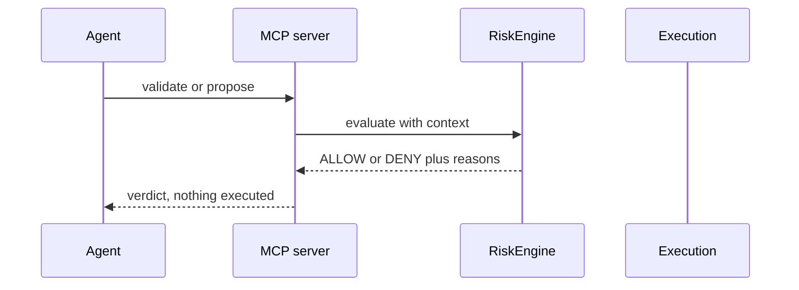

# Agent harness guide

How an AI agent should drive this MCP server safely and effectively.

## 1. Discover before acting

Start every session with `indodax_health` and
`indodax_system_capabilities`. If `funding.withdraw` is anything but
disabled, stop and report; the server is misconfigured.

## 2. Read before mutating

* Prices: `indodax_ticker` for one pair, `indodax_tickers_all`
  for scans, `indodax_orderbook` for spread.
* Account: `indodax_account` and `indodax_balances` need
  credentials and fail cleanly without them.
* History: `indodax_order_history` and `indodax_trade_history`
  use v2 endpoints. The v1 names are dead upstream.

## 3. Never place blind

The only path to an order is validate, then propose, then place:

1. `indodax_validate_order` returns the risk verdict.
2. `indodax_propose_order` returns a proposal id plus verdict.
3. `indodax_create_order` executes into paper by default.

Live requires `mode: "live"` plus `acknowledged: true`, and the
server still denies it unless explicitly enabled. Treat any live
success as a deliberate operator decision, not a default.

## 4. Read every response envelope

Success: `{ status: "ok", data, fetchedAt }` with optional
`warnings`. Failure: `{ status: "error", code, message, retryable,
operationId }` with `isError: true`. Branch on `code`, never on
message text. Retry only when `retryable` is true, and never retry
order placement after an ambiguous result. Reconcile first with
`indodax_reconcile_orders` or `indodax_reconcile_trades`.

## 5. Track work with correlation ids

Proposals return `correlationId`. Follow one operation end to end
with `indodax_execution_trace`. Unknown outcomes stay `UNKNOWN`
until reconciliation proves otherwise.

## 6. Use prompts for reviews

`indodax_market_review`, `indodax_portfolio_review`,
`indodax_order_review`, `indodax_strategy_review`, and
`indodax_incident_review` structure multi-step analysis. Prompt
output never contains live market facts; always call the tools.

## 7. Memory discipline

Prior analysis, preferences, and incidents may come from memory.
Current price, balance, position, permission, and exchange state
must come from tools or a validated local replica, never memory.
