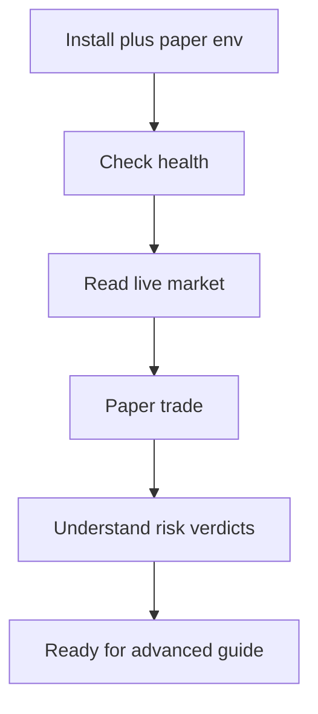

# Beginner guide

New to this project. This path keeps real money out of reach while
you learn the tools.



## 1. Install

```bash
cp .env.example .env
bun install
bun run check
```

Leave `.env` credentials empty for now. Everything below works
without them.

## 2. Check health

```bash
bun apps/cli/src/main.ts risk limits
bun apps/cli/src/main.ts paper status
```

Or via MCP: call `indodax_health` and `indodax_paper_status`.

## 3. Read the live market

```bash
bun apps/cli/src/main.ts market ticker btc_idr
```

No credentials needed. Output shows last price plus 24h stats.

## 4. Make your first paper trade

Paper starts with 100,000,000 IDR plus 1 BTC of virtual funds.

```bash
bun apps/cli/src/main.ts paper balances
```

Via MCP, in order:

1. `indodax_paper_order` with pair `btc_idr`, side `BUY`,
   price `1000`, quantity `100`.
2. Note the returned paper id, for example `paper-1`.
3. `indodax_paper_fill` with that id and a fill price.
4. `indodax_paper_status` to see trade count and fees.

Nothing here touches the exchange. Amounts below 10,000 IDR
notional are rejected by risk; that is the minimum order rule
working, not an error in your call.

## 5. Understand a risk verdict

Call `indodax_risk_evaluate` with any pair, side, quantity, and
price. The answer is one of `ALLOW`, `DENY`, `REVIEW`, or `HALT`
with machine-readable reasons. Denials name the exact rule, for
example `MIN_ORDER_SIZE` or `LIVE_MODE_DENIED`.

## Rules that protect you

* Paper is the default. Live needs explicit mode plus capability.
* Withdrawal is always denied by this server.
* Prompts never place orders; only explicit order tools do, and
  only into paper unless live is deliberately enabled.

Next: [Advanced guide](advanced.md).
