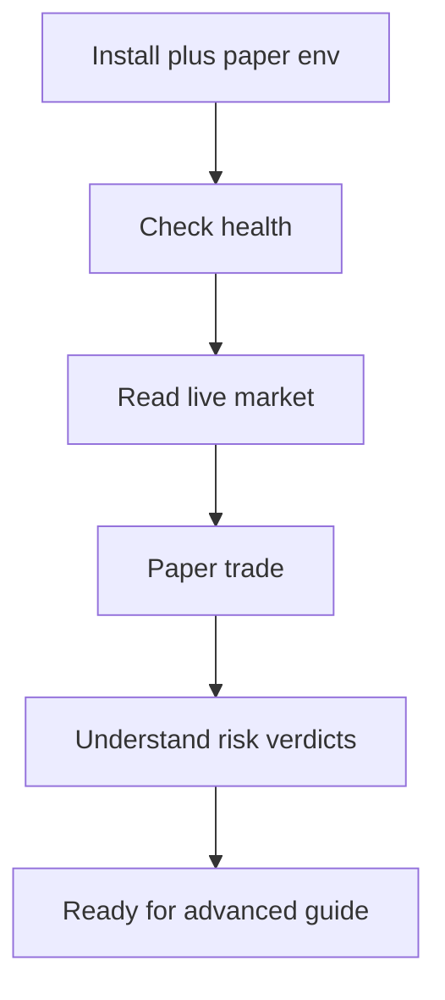

<h1 align="center">Beginner guide</h1>

This guide keeps execution in paper mode while you learn the MCP, CLI, and risk model.

## 1. Install

One command, no clone and no database:

~~~bash
bun add -g @indodax-mcp/cli
~~~

That installs the `indodax` binary. Bun is required. To avoid a global install,
substitute `bunx -y @indodax-mcp/cli` in every command below.

To also run the MCP server for an agent harness, add
`@indodax-mcp/indodax-mcp`. See the repository [README](../../README.md) for the
client configuration.

Leave exchange credentials empty. Public market reads and paper execution do not require them.

## 2. Check the server

~~~bash
indodax risk limits
indodax paper status
~~~

Via MCP, call indodax_health and indodax_paper_status.

## 3. Read the market

~~~bash
indodax market ticker btc_idr
~~~

This uses the public market API and does not require credentials.

## 4. Place a paper order

The default paper ledger starts with 100,000,000 IDR and 1 BTC.

~~~bash
indodax paper balances
~~~

Example MCP order:

~~~text
indodax_paper_order
pair: btc_idr
side: BUY
price: 1000
quantity: 100
~~~

The example notional is 100,000 IDR and exceeds the current application minimum risk limit of 10,000.

After acceptance, call indodax_paper_fill with the returned order id and a fill price, then read indodax_paper_status.

**Paper execution never sends the order to INDODAX.**

## 5. Understand a risk decision

Call indodax_risk_evaluate with pair, side, quantity, price, and optional mode.

The current risk engine returns ALLOW, DENY, or HALT. Common machine-readable reasons include MIN_ORDER_SIZE, MAX_ORDER_SIZE, LIVE_MODE_DENIED, and CAPABILITY_DENIED.

## Safety rules

- Paper is the supported trading mode.
- Withdrawal is always denied.
- A proposal or validation result does not mean an order was executed.
- Do not use authenticated exchange credentials until you need authenticated reads.

Next: [Advanced guide](advanced.md).
