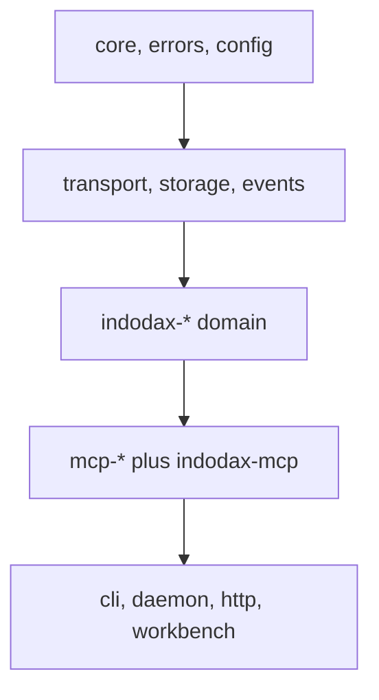

# Developer guide

Reference for contributors extending this monorepo.



## 1. Boundaries

* Generic packages (`core`, `mcp-*`, `transport`, `storage`) never
  import INDODAX packages. Apps compose everything.
* Raw exchange JSON stops at the adapter. Domain code sees zod
  DTOs and canonical models only.
* Money is `Decimal` from parse time. No float math on balances,
  prices, fees, or PnL.
* Financial core never imports LLM SDKs.

## 2. Add a tool

1. Define metadata plus zod schemas in
   `packages/indodax-mcp/src/tools/<domain>.ts`.
2. Implement the handler: parse args, check capability, call the
   service, return `ok` or `fail`.
3. Register in `packages/indodax-mcp/src/index.ts`.
4. Cover success, validation failure, and denial in
   `packages/indodax-mcp/test/surface.test.ts`.
5. Document it in [MCP surface](../../mcp/surface.md) and the relevant guide.

Every mutation tool declares capability, risk class, environment,
auth, destructiveness, idempotency, and audit class in metadata.
Enforcement is programmatic, not descriptive.

## 3. Add a package

1. Scaffold `package.json`, `tsconfig.json`, `src/index.ts`.
2. Depend only downward in the layer order.
3. Add unit tests plus property tests for invariants.
4. Register `test:coverage` so Turbo picks it up.

## 4. Storage changes

Edit `packages/db/src/schema.ts`, then generate and review the
migration before applying:

```bash
bun --filter @indodax-mcp/db db:generate
bun --filter @indodax-mcp/db db:migrate
```

Domain code depends on repository interfaces, never on Drizzle
connections.

## 5. Quality gates

```bash
bun run format:check
bun run lint
bunx turbo typecheck
bunx turbo test
bunx turbo build
bunx playwright test
```

Keep files at or under 350 lines. Fix the underlying problem;
never weaken a gate to turn red green.

## 6. Migration notes

* [Recon](../migration/recon.md) maps the original Rust behavior.
* [Rust to TypeScript](../migration/rust-to-typescript.md) maps responsibilities.
* [Migration v1 to v2](../migration/v1-to-v2.md) is the historical rebuild record.
* [API mapping](../api/mapping.md) maps every official endpoint to code.
