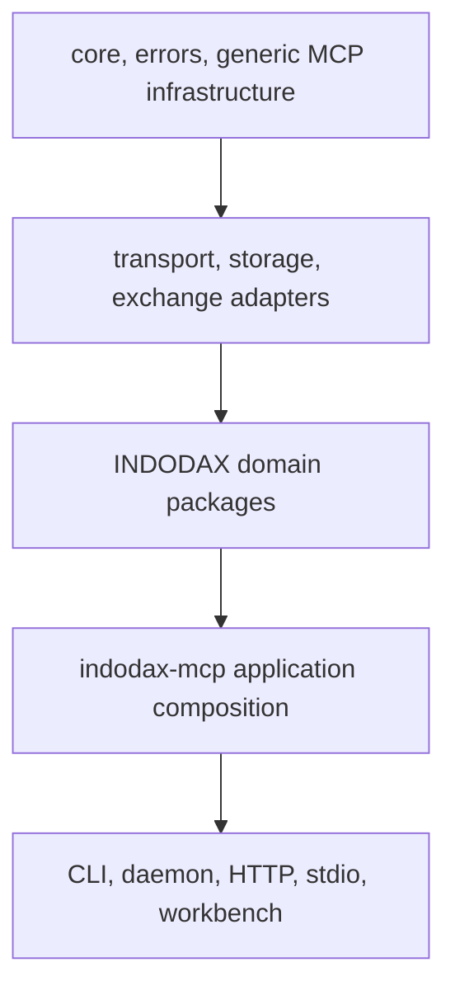

<h1 align="center">Developer guide</h1>

Reference for contributors extending the current Bun monorepo.

## 1. Boundaries

Generic packages should not depend on INDODAX domain packages. Exchange protocol details belong in adapters. Financial code uses Decimal and does not import LLM SDKs.

## 2. Add a tool

1. Define metadata and a Zod schema under packages/indodax-mcp/src/tools.
2. Implement a thin handler: parse arguments, enforce operation-specific guards, call a service, serialize the result.
3. Register the tool in packages/indodax-mcp/src/index.ts.
4. Add regression coverage for success, validation, and denial paths.
5. Update the MCP surface documentation.

The registry validates metadata, and a central guard enforces authentication and environment. Capability, risk, and audit enforcement stays in executable handler or service code.

## 3. Add a package

1. Add package.json, tsconfig.json, and src/index.ts.
2. Depend only on lower layers.
3. Add unit and invariant/property tests where useful.
4. Expose only the API needed by consumers.

Do not introduce a generic dependency on an INDODAX-specific package just to bypass a boundary.

## 4. Database changes

Schema changes belong in packages/db/src/schema.ts.

Generate and review migrations:

~~~bash
bun --filter @indodax-mcp/db db:generate
bun --filter @indodax-mcp/db db:migrate
~~~

The database package contains PostgreSQL schema and repositories, but the main application composition still uses in-memory state. Do not document PostgreSQL as the runtime source of truth until the composition and integration tests prove it.

## 5. Quality gates

~~~bash
bun run format:check
bun run lint
bunx turbo typecheck
bunx turbo test
bunx turbo build
bunx playwright test
bun run verify
~~~

Fix the underlying problem. Do not weaken a gate to make CI pass.

## 6. File size

Keep authored files at or under 350 lines. 375 lines is the hard ceiling.

For broad changes, measure with a consistent command such as:

~~~bash
wc -l path/to/file.ts path/to/file.md
~~~

Report path, line count, target, and status. Do not split code mechanically only to satisfy the limit.

## 7. Migration references

Read [Rust to TypeScript](../migration/rust-to-typescript.md), [Recon](../migration/recon.md), and [API mapping](../api/mapping.md) before changing migration-sensitive behavior.
