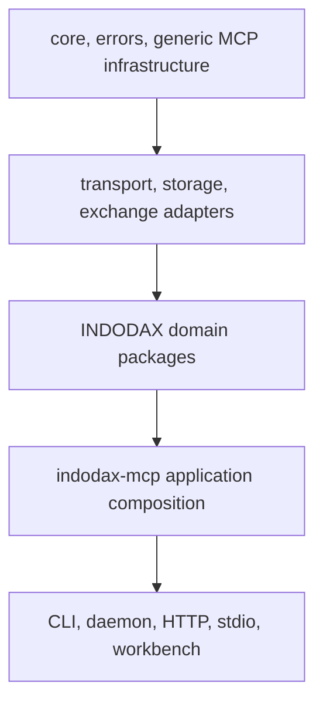

<h1 align="center">Developer guide</h1>

Reference for contributors extending the current Bun monorepo.

## 1. Boundaries



Generic packages should not depend on INDODAX domain packages. Exchange protocol details belong in adapters. **Financial code uses `Decimal` and does not import LLM SDKs.**

## 2. Add a tool

1. Declare metadata and a Zod shape once with `defineTool` under packages/indodax-mcp/src/tools.
2. Register that definition and have the handler parse with the same `inputSchema`.
3. Implement a thin handler: parse arguments, enforce operation-specific guards, call a service, serialize the result.
4. Register the tool group in packages/indodax-mcp/src/index.ts.
5. Add regression coverage for success, validation, and denial paths.
6. Update the MCP surface documentation and the matching docs/tools page.

Step 2 is a correctness requirement, not style. The SDK strips arguments the
registered schema does not declare, so a handler that parses a wider shape
receives nothing for the extra keys and the call silently succeeds with the
parameters dropped. Every group follows this, and
`packages/indodax-mcp/test/audit-tool-schema.test.ts` fails the build if a module
registers a literal schema inside `parseArgs`, if a module parses arguments
without declaring a definition, or if a new tool module is missing from the
list the test checks for coverage.

The registry validates metadata, the central guard enforces environment and
credentials, and MCP annotations are derived from the same metadata for client
gating. Capability, risk, and audit enforcement stays in executable handler or
service code.

## 3. Add a package

1. Add package.json, tsconfig.json, and src/index.ts.
2. Depend only on lower layers.
3. Add unit and invariant/property tests where useful.
4. Expose only the API needed by consumers.

Do not introduce a generic dependency on an INDODAX-specific package just to bypass a boundary.

### Import style

**Every** module is imported through its package name. Relative imports are not used
anywhere in `packages/*` or `apps/*`:

```ts
import type { ToolMetadata } from "@indodax-mcp/mcp-contracts";
import { parseSymbolFlexible } from "@indodax-mcp/core";
import { checkPaperConsistency } from "@indodax-mcp/indodax-mcp/paper-consistency";
```

The bare name is the package entry point; a trailing path is one module inside that
package. Two consequences worth knowing:

- **Do not add a `.js` extension.** A package-name specifier resolves through the
  `exports` map, so the extension is unnecessary. This is the reason the tree no longer
  needs a hand-written extension: `tsc` never rewrites a specifier, so a relative
  import had to carry its own extension to survive into `dist/` and load in Node.
- **Keeping imports package-shaped makes the layering visible.** A reader can see that
  `core` does not know about `indodax-market` without tracing a file path, and a wrong
  dependency shows up as an undeclared entry rather than a silent path.

Resolution is wired up in three places, and they must stay in step:

| Layer | Mechanism | Purpose |
| --- | --- | --- |
| `tsconfig.base.json` | `paths` per workspace package | typecheck straight to source, no build needed |
| `packages/*/tsconfig.build.json` | `paths` narrowed to the own package | keep `rootDir` at `src` while emitting declarations |
| `packages/*/package.json` | `exports` with a `./*` subpath | keep emitted subpath declarations resolvable |

`apps/mcp-workbench` needs an explicit `resolve.alias` because Vite does not read
TypeScript `paths`. Its Vitest config merges the Vite config so the two cannot drift.

`packages/indodax-mcp/test/audit-import-style.test.ts` fails the build if a relative
import reappears, so this rule is enforced rather than merely documented.

## 4. Database changes

Schema changes belong in packages/db/src/schema.ts.

Generate and review migrations:

~~~bash
bun --filter @indodax-mcp/db db:generate
bun --filter @indodax-mcp/db db:migrate
~~~

The database package contains PostgreSQL schema and repositories, but the main application composition still uses in-memory state. Do not document PostgreSQL as the runtime source of truth until the composition and integration tests prove it.

## 5. Quality gates

~~~bash
bun run format:check
bun run lint
bunx turbo typecheck
bunx turbo test
bunx turbo build
bunx playwright test
bun run verify
~~~

**Fix the underlying problem. Do not weaken a gate to make CI pass.**

## 6. File size

Keep authored files at or under 350 lines. 375 lines is the hard ceiling.

For broad changes, measure with a consistent command such as:

~~~bash
wc -l path/to/file.ts path/to/file.md
~~~

Report path, line count, target, and status. Do not split code mechanically only to satisfy the limit.

## 7. Migration references

Read [Rust to TypeScript](../migration/rust-to-typescript.md), [Recon](../migration/recon.md), and [API mapping](../api/mapping.md) before changing migration-sensitive behavior.
