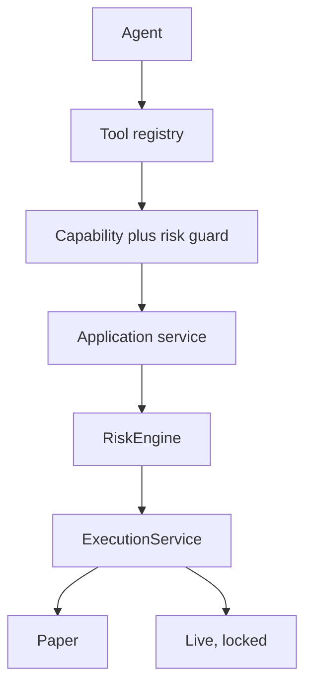

# MCP surface

Transport: stdio JSON-RPC via `apps/mcp-stdio`, Streamable HTTP via
`apps/mcp-http` on the official Hono adapter. Both share one registry
and dispatch, so behavior is identical. Protocol 2025-11-25.

## Tool groups (73 tools)

Market (10): server time, pairs, ticker, tickers all, orderbook,
trades, candles, price increments, summaries, market status via WS.

Account (3 plus history): account, balances, capabilities, open
orders, order details, order history (v2), trade history (v2).

Orders (4): validate, propose, create (paper default, live locked),
cancel (paper default, live locked).

Portfolio (3): portfolio, positions, PnL with live-price exposure.

Risk (3): limits, state (includes Deadman), evaluate.

Paper (9): account, status, orders, snapshots, place, fill, cancel,
reset, fills list. Simulated money only.

Strategy (4) and backtest (3 with stored runs): list, detail,
evaluate, validate, run (stored with id), get, compare.

Alerts (4): list, create, cancel, check against live price.

Reconciliation (4): balances, orders, trades, ledger state.

Audit (3): events, execution trace, risk decisions.

System (8) plus auth and funding guard: health, readiness, version,
capabilities, config, runtime, auth status, withdraw denial.

Funding reads (5): withdraw history, deposit history, fiat history,
deposit address, withdraw fee. Mutations locked.

History extras: paper fills.

Operations: exposure, WebSocket reconnect, Deadman arm/status/disarm.

WebSocket (2): status, one-shot ticker snapshot.

## Resources (11) and prompts (5)

Resources expose state: market snapshot, pair metadata, account,
open orders, portfolio, risk, reconciliation, audit, health,
websocket, capabilities. Prompts guide market, portfolio, order,
strategy, and incident review. Prompts never place orders.
