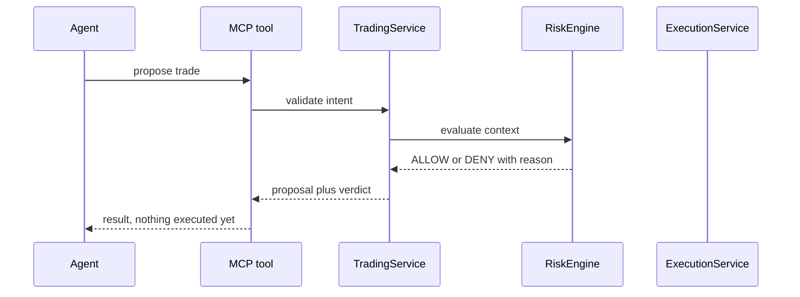

# MCP tool implementation

Each area under `tools/` owns three things: the tool schemas agents see,
the dispatch from `execute_tool`, and the calls into shared services.
Nothing in this folder signs requests, manages sockets, or decides risk.
Those live in `indodax-api`, `indodax-websocket`, and `indodax-risk`.

* `market.rs`: live public reads through `MarketService`.
* `account.rs`: credential-gated reads through `AccountService`.
* `trading.rs`: validate and propose through `TradingService`; paper
  placement goes through `ExecutionService` with an approved decision.
* `paper.rs`: simulation state through `PaperBackend`.
* `risk.rs`: pure evaluation through `RiskEngine`.
* `system.rs`: health, mode, capabilities, credential presence, funding
  reads, withdrawal denial, WebSocket snapshots.

Mutations need stronger guards than reads. Withdrawal stays on the
separate `funding.withdraw` capability and is denied by default.
