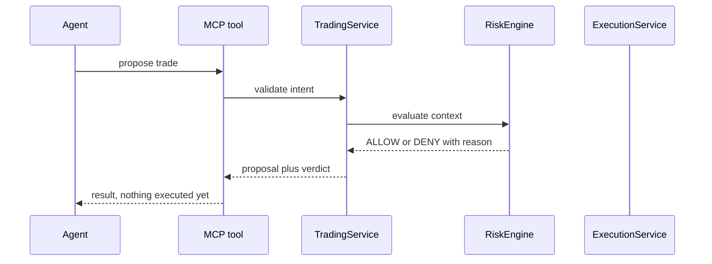
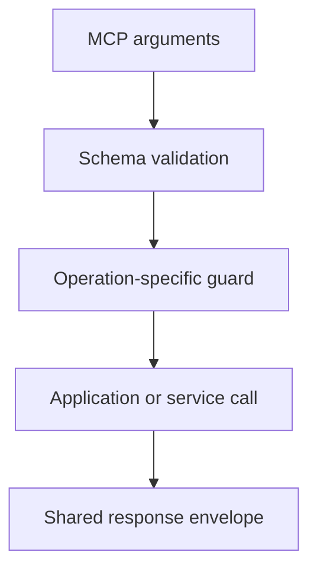

<h1 align="center">MCP tool implementation</h1>

MCP tools are protocol adapters around the application services and exchange-facing packages. Tool handlers should remain small so the same behavior can be tested without an MCP transport.

## Handler pattern

Handlers **must not** own exchange signing, WebSocket protocol details, database access, or financial policy.

## Registration

Tool definitions live under packages/indodax-mcp/src/tools.

A normal tool has:

1. metadata,
2. a Zod input schema,
3. a handler registration,
4. conversion into the common response envelope.

The registry validates metadata when a tool is registered.

## Current groups

- market.ts: public market reads with quote and limit filters.
- account.ts: authenticated account reads.
- orders.ts: order validation, proposals, paper creation, and paper cancellation.
- paper.ts: paper ledger operations and risk-reviewed paper placement.
- risk.ts: direct deterministic risk evaluation.
- reconcile.ts: balance comparison, paper-local consistency checks, and full exchange reconciliation (open orders, fills, balances) with halt tracking.
- system.ts: status, configuration, authentication state, WebSocket snapshots, and withdrawal denial.
- funding.ts: authenticated read-only funding information.
- history.ts and ops.ts: history, operational helpers, and private channel connect.
- stop.ts and stop-store.ts: server-side emulated stops plus trigger checks.
- deadman.ts: Deadman safety state tools.
- order-intent.ts: shared intent drafting plus the live placement path.

## Response contract

Success:

~~~json
{
  "status": "ok",
  "data": {},
  "fetchedAt": "..."
}
~~~

Failure:

~~~json
{
  "status": "error",
  "code": "ValidationError",
  "message": "...",
  "retryable": false
}
~~~

MCP failures also set isError=true. Agents should branch on stable error codes, not message text. Some harnesses surface an isError result as a thrown Error whose message is the JSON payload, so parse the message body instead of expecting a thrown object.

Money, price, and quantity values serialize as strings to preserve Decimal precision. Never parse them into floats for accounting. A `fetchedAt` inside data is the domain read time; the envelope `fetchedAt` is the response time.

Pair spellings follow the exchange per endpoint: canonical `btc_idr` for tickers and balances, compact `btcidr` for depth, trades, and candles, uppercase `BTCIDR` for authenticated order calls. The market package normalizes user input into each form.

## Mutation rules

Paper mutations must remain simulation-only.

Live-capable paths must enforce mode, capability, acknowledgement where applicable, server policy, risk approval, idempotency, and audit requirements in executable code. Paper stays the default; live additionally needs `APP_ENV=live`.

**Withdrawal remains denied by design.**

## Known limits

The MCP surface is broad, but the current runtime still has integration gaps around durable persistence, full exchange reconciliation, authoritative risk context, and idempotency-aware retry handling.

Do not describe a tool as production-complete solely because its schema or package implementation exists.
