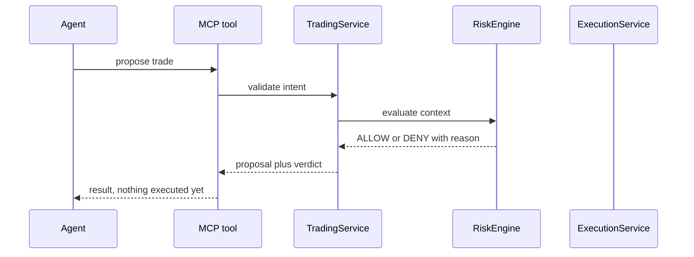
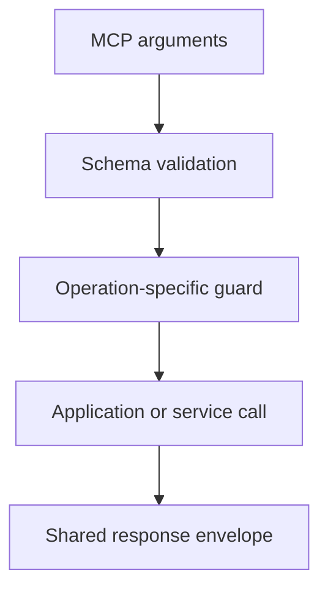

<h1 align="center">MCP tool implementation</h1>

MCP tools are protocol adapters around the application services and exchange-facing packages. Tool handlers should remain small so the same behavior can be tested without an MCP transport.

## Handler pattern

Handlers **must not** own exchange signing, WebSocket protocol details, database access, or financial policy.

## Registration

Tool definitions live under packages/indodax-mcp/src/tools, which is the source directory of the `@indodax-mcp/mcp-app` package. The directory keeps its historical name; the published package name is what code imports.

A normal tool has:

1. metadata and a Zod input shape, declared once through `defineTool`,
2. a registration that consumes that definition,
3. a handler that parses with the same schema object,
4. conversion into the common response envelope.

The registry validates metadata when a tool is registered.

Declaring the shape once is a correctness requirement, not a style preference. The MCP SDK validates incoming arguments against the registered `inputSchema` and strips anything it does not declare. A handler that re-declared a wider schema would parse those keys as absent, so `indodax_validate_order` silently discarded `timeInForce` and `stpMode` before this constraint existed.

Every tool group uses `defineTool`, so this is now a repository invariant rather than a convention. A test asserts that no module builds a schema literal inside `parseArgs`, and that any module parsing arguments declares a definition. Adding a new tool group therefore fails the build unless it follows the pattern. `refineTool` wraps a definition when a rule spans fields, for example a cancel that needs either `orderId` or `clientOrderId`.

## Annotations

Every tool is registered with MCP annotations derived from its metadata: `readOnlyHint` from the risk class, `destructiveHint` from the declared flag, `idempotentHint` from the idempotency class, and `openWorldHint` for the READ and TRADE capabilities that reach the exchange. Harnesses can gate a call before invoking it.

Annotations are advisory. The central guard and risk review remain the enforced boundary.

## Current groups

- market.ts: public market reads with quote and limit filters.
- market-scan.ts: the bulk screening scan.
- candles.ts: the candle series.
- symbols.ts: symbol resolution against the live pair list.
- quote.ts: pre-order fill estimation.
- rounding.ts: precision preflight and stop sizing.
- account.ts: authenticated account reads plus the capability gate.
- orders.ts: order validation, placement, and cancellation.
- portfolio.ts and positions.ts: paper valuation and live position valuation.
- snapshot.ts: the single-call monitoring picture.
- paper.ts: the paper ledger and risk-reviewed paper placement.
- risk.ts: limits, gate state, and direct deterministic risk evaluation.
- reconcile.ts: paper-local and exchange-backed reconciliation, split by whether credentials are needed.
- system.ts: status, configuration, WebSocket snapshots, and withdrawal denial.
- funding.ts: authenticated read-only funding information.
- history.ts: order and trade history.
- ops.ts, ops-sockets.ts, ops-backtest.ts, ops-exposure.ts: stored backtests, exposure, and socket lifecycle.
- audit.ts: the filtered audit trail.
- alerts.ts: local price alerts and their evaluation.
- strategy.ts: the strategy catalog and signal evaluation.
- stop.ts, stop-create.ts, stop-check.ts, stop-store.ts, stop-trigger.ts: server-side emulated stops plus trigger evaluation.
- oco.ts and oco-attach.ts: linked position protection.
- deadman.ts: Deadman safety state tools.
- docs.ts: the runtime guide pages.
- order-intent.ts, paper-order.ts: shared intent drafting plus the placement paths.

## Response contract

Success:

~~~json
{
  "status": "ok",
  "data": {},
  "fetchedAt": "..."
}
~~~

Failure:

~~~json
{
  "status": "error",
  "code": "ValidationError",
  "message": "...",
  "retryable": false
}
~~~

MCP failures also set isError=true. Agents should branch on stable error codes, not message text. Some harnesses surface an isError result as a thrown Error whose message is the JSON payload, so parse the message body instead of expecting a thrown object.

Two error paths exist by transport design and both must be handled:

1. Handler errors arrive as the envelope above with a stable `code`.
2. Schema violations are rejected by the MCP protocol layer before any handler runs, surfacing as harness text such as `Invalid arguments for tool "..."`. The input schemas stay strict on purpose so discovery lists exact parameters; agents must treat a protocol-level rejection as a validation failure and retry with corrected arguments.

Money, price, and quantity values serialize as strings to preserve Decimal precision. Never parse them into floats for accounting. A `fetchedAt` inside data is the domain read time; the envelope `fetchedAt` is the response time.

Pair spellings follow the exchange per endpoint: canonical `btc_idr` for tickers and balances, compact `btcidr` for depth, trades, and candles, uppercase `BTCIDR` for authenticated order calls. The market package normalizes user input into each form, so every tool accepts any common spelling (`btc_idr`, `BTCIDR`, `BTC/IDR`) and only the exchange wire format differs.

Component health `unknown` means that check is not wired (database, exchange REST/WS probes, queue), not that it failed. `indodax_health` with `readiness: true` reports `ready` only for an overall `healthy` rollup and lists every non-healthy component in `degradedReasons`.

## Mutation rules

Paper mutations must remain simulation-only.

Live-capable paths must enforce mode, capability, acknowledgement where applicable, server policy, risk approval, idempotency, and audit requirements in executable code. Paper stays the default; live additionally needs `APP_ENV=live`.

**Withdrawal remains denied by design.**

## Known limits

The MCP surface is broad, but the current runtime still has integration gaps around durable persistence, full exchange reconciliation, authoritative risk context, and idempotency-aware retry handling.

Do not describe a tool as production-complete solely because its schema or package implementation exists.
