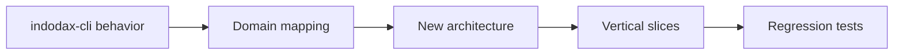

# Migration from indodax-cli

> Historical record of the original rebuild. The current TypeScript
> platform is mapped in [Rust to TypeScript](rust-to-typescript.md).

Indodax MCP is a rebuild of
[indodax-cli](https://github.com/ibidathoillah/indodax-cli) by
ibidathoillah, rebuilt for high flexibility and extended features under the name
Indodax MCP, with usage expanded for AI agents, humans, and developers.
The previous repository license is preserved in `LICENSE_COPY/` while
this project itself is licensed under SSPL v1, copyright D1ZZY4.

Behavior preserved from the original:

* HMAC-SHA512 signing and monotonic nonce (`indodax-auth`).
* Token-bucket rate limiting default around 5–7 rps.
* V1 `getInfo/openOrders/trade/cancelOrder` and V2 history endpoints.
* Public/private WebSocket URLs and fallback public token.
* Paper balances, fees, and order semantics.
* OAuth Authorization Code + PKCE shape for the HTTP bridge.

Intentional v2 changes:

* Decimal money instead of `f64` for balances and risk limits.
* Explicit `OrderState` machine; timeouts become `Unknown`.
* Risk returns typed `Allow/Deny/Halt` with `RiskReason`.
* Paper and live share `ExecutionBackend`.
* MCP never calls the exchange client directly.

## Corrections from official docs (btcid/indodax-official-api-docs)

* TAPI v1 signs with HMAC-SHA512; TAPI v2 signs with HMAC-SHA256.
  `Signer::sign_v2` now uses SHA256.
* TAPI v2 failures use `{code, msg}` with HTTP 400-500. `parse_v2_value`
  surfaces `-1002` credential failures as authentication errors.
* `transHistory` enforces a 7-day window validated client-side.
* TAPI v2 base is `https://api.indodax.com`, verified live.
* Live orders use signed TAPI v2 `POST /api/v2/order` and
  `DELETE /api/v2/order`, per the official endpoint reference.

## Intentionally not ported

* The v1 OAuth Authorization-Code + PKCE browser flow is not ported.
  The gateway uses an optional bridge-secret header instead. See
  [ADR OAuth](../adr/005-oauth.md) for the reason.
* Paper WASM web UI from v1 docs is out of scope for this backend.
