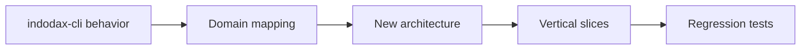

<h1 align="center">Migration from indodax-cli</h1>

This page is a **historical migration record** for the rebuild from [indodax-cli](https://github.com/ibidathoillah/indodax-cli). Current implementation status is documented separately in the architecture and completeness pages.

## Preserved responsibilities

The rebuild retains these broad responsibilities:

- Decimal-based financial values.
- Isolated authentication and transport.
- Distinct legacy and TAPI v2 signing.
- Explicit order lifecycle and reconciliation concepts.
- Deterministic risk evaluation.
- Shared paper/live execution abstraction.
- Agent intent separated from execution authority.
- Thin MCP tools.
- CLI, HTTP, stdio, daemon, and workbench application boundaries.

## Expanded scope

The rebuild expands the original CLI scope for **developers**, **beginners**, **advanced users**, and **agent harnesses**. Beginners get a paper-only path with guided market, account, and risk flows. Advanced users get deterministic backtests, portfolio analytics, reconciliation primitives, and operational tooling. Developers get typed packages, explicit boundaries, and test harnesses across MCP, CLI, HTTP, stdio, daemon, and workbench surfaces.

An agent harness can operate an account through the MCP surface, so **supervise your agent harness and do not trust it blindly**. Give it **clear instructions with full context**, and verify proposals against current balances, risk verdicts, and reconciliation state before acting.

The current composition keeps **default safeguards that constrain agent harnesses**, including paper-default policy with APP_ENV-gated live, explicit capability metadata, auth and environment guards, deterministic risk review, and no server-side withdrawal path.

## Important protocol corrections

The current official TAPI v2 documentation specifies:

- `HMAC-SHA256` for signed v2 requests.
- `api.indodax.com` as the v2 base URL.
- Form-encoded `POST` bodies and query-string `GET`/`DELETE` parameters.
- Dedicated v2 order, account, open-order, order-history, and trade-history endpoints.
- Timestamp or nonce authentication with `recvWindow` support.

Legacy v1 signing remains `HMAC-SHA512` and is isolated from the v2 signer.

## Intentional architecture changes

- TypeScript/Bun replaces the Rust workspace.
- `Decimal.js` is used at the financial boundary.
- The order state machine is implemented in `packages/indodax-orders`.
- Risk is a **deterministic service** with typed reasons.
- Paper and live share the execution interface, with paper as the default and live gated by environment, credentials, acknowledgement, and risk approval.
- MCP handlers do **not own exchange signing or protocol details**.
- PostgreSQL schema and repositories replace the old file-store direction at the persistence layer, but the main application remains **in-memory until repository wiring is completed**.
- The old browser OAuth Authorization Code + PKCE flow is **not part of the current gateway**.
- The paper WASM/browser path is **not part of the current backend**.

## Current source references

See [API mapping](../api/mapping.md) and [Source references](../references/sources.md) for current upstream documentation. See [Completeness](../architecture/completeness.md) for what is actually wired and tested.
