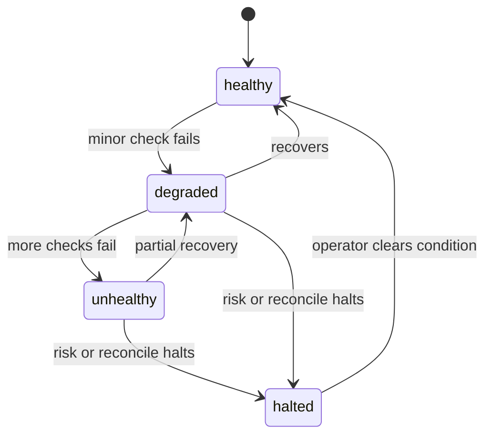

# Operations

## Checks

`scripts/check.sh` runs install, format check, lint, typecheck,
tests, and build through Turborepo. CI runs the same script on every
push.

## Health

Query `indodax_health`. Five states: healthy, degraded, unhealthy,
unknown, halted. Halted means risk or reconciliation stopped trading;
do not trust order tools until health recovers.
`indodax_runtime_status` reports scheduler jobs, sockets, metrics,
and Deadman state. `indodax_readiness` reports whether the server can
serve traffic.

## Metrics

Counters cover submitted, filled, and rejected orders, risk rejections,
exchange errors, WebSocket reconnects, reconciliation failures, and MCP
requests with failures. Read them through `indodax_runtime_status` or
the observability package in-process.

## Live credential rotation

Keys live in process env (`INDODAX_API_KEY`,
`INDODAX_API_SECRET`), never in the repo. After rotating a key on the
exchange dashboard, restart the MCP server, HTTP gateway, and daemon so
each process picks up the new values. Re-run `indodax_auth_status`
to confirm the new credentials are configured, then `indodax_account`
before enabling any trading.
