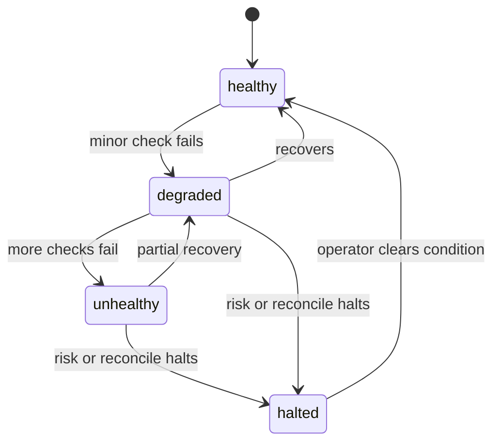

<h1 align="center">Operations runbook</h1>

This runbook covers the current application and its operational limits. Paper is the default and operational state is in-memory; live additionally needs the full gate from the trading modes page.

## Validation

Run the repository gates before release or deployment:

~~~bash
bun run format:check
bun run lint
bunx turbo typecheck
bunx turbo test
bunx turbo build
bunx playwright test
bun run verify
~~~

The active GitHub workflow runs format, lint, typecheck, test, build, end-to-end, consumer verification, and migration drift checks.

## Health

Use indodax_health for the service rollup.

Use indodax_readiness to check whether the server considers itself able to serve traffic.

Use indodax_runtime_status for scheduler state, socket state, counters, and Deadman state.

A halted risk or reconciliation condition should be treated as a closed trading path. Paper stays the default; live additionally needs the full gate from the trading modes page.

## Market and WebSocket checks

Standalone price monitor `scripts/monitor.ts` watches any pair without credentials or orders. Configure through `MONITOR_PAIR`, `MONITOR_REFERENCE` (defaults to the first tick), `MONITOR_UP_PCT`, `MONITOR_DOWN_PCT`, and optional `MONITOR_AMOUNT_HELD` for position valuation. Snapshots land every random 10 to 30 seconds. A trigger sends a desktop notification and exits by default so a supervisor picks up the alert; set `MONITOR_EXIT_ON_TRIGGER=0` to keep looping.

Use indodax_ws_status to inspect managed socket state and subscriptions.

Use indodax_ws_ticker for a one-shot market snapshot.

The private channel connects with a generated 24h token through `indodax_private_connect` and streams order updates over the official dialect. Treat it as a live event mirror, not as durable order-state synchronization. Reconnect with `indodax_ws_reconnect` scope private when the token nears expiry.

## Credential rotation

Credentials are read from process environment.

After rotating an INDODAX key:

1. update the deployment environment;
2. restart the MCP server and any long-running daemon;
3. call indodax_auth_status;
4. call indodax_account using read-only access;
5. review configuration and policy before any future live enablement.

**Never place an order as a credential test.**

## Database

The database package provides PostgreSQL schema, migrations, and repository implementations. Paper ledgers, audit trails, alerts, and stops mirror to Postgres when configured and reload on boot. Runtime state without a database row stays in memory.

Local Postgres without sudo:

~~~bash
initdb --auth=trust --locale=C.UTF-8 -D ~/pgdata
pg_ctl -D ~/pgdata -l ~/pgdata.log -o "-p 5433 -k /tmp" start
~~~

Then point `DATABASE_URL` at it and migrate from `packages/db`:

~~~bash
cd packages/db && DATABASE_URL=postgresql://dizzy@127.0.0.1:5433/indodax bun ./src/migrate.ts
~~~

The current main application composition does not use PostgreSQL as its source of truth. Database health must therefore be evaluated separately from MCP application health until runtime wiring is completed.

## Incident handling

When an operation is ambiguous:

1. preserve the correlation id and client order id;
2. do not blindly retry a state-changing request;
3. inspect exchange order and trade state through authoritative reads;
4. compare local and exchange state;
5. record the incident and resulting decision.

The current reconciliation MCP tools are not yet a complete exchange reconciliation workflow.

## Recovery principle

**Do not infer recovery from process health alone.** A restarted process can be healthy while its in-memory paper state has reset. Durable recovery requires persistent state and replay/reconciliation integration that is not yet present in the main composition.
