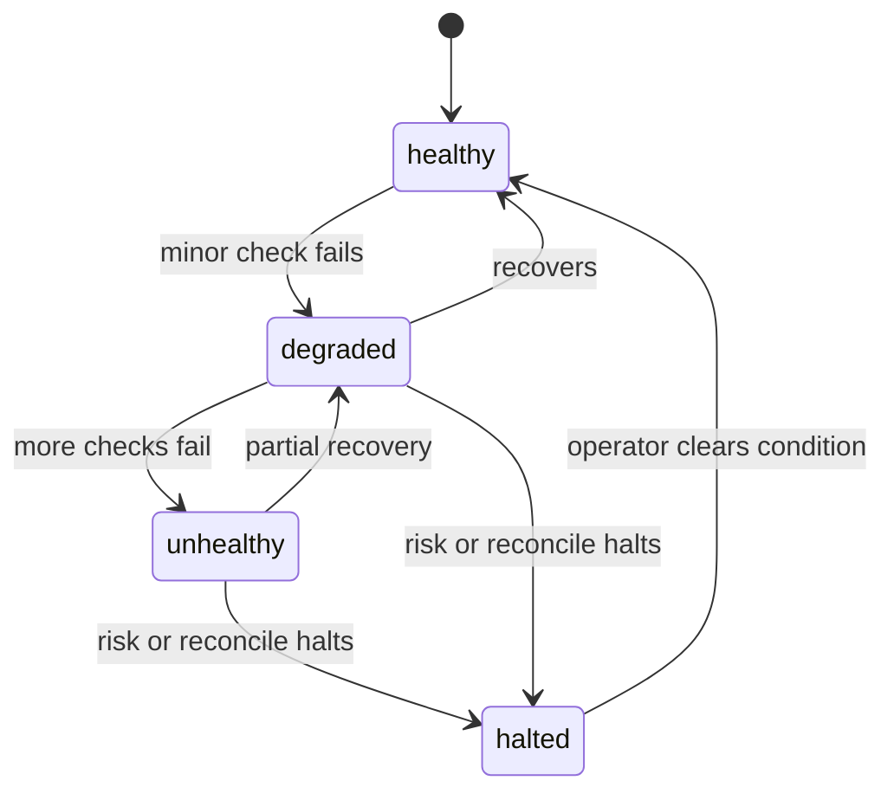

<h1 align="center">Operations runbook</h1>

This runbook covers the current application and its operational limits. Paper is the default and operational state is in-memory; live additionally needs the full gate from the trading modes page.

## Validation

Run the repository gates before release or deployment:

~~~bash
bun run format:check
bun run lint
bunx turbo typecheck
bunx turbo test
bunx turbo build
bunx playwright test
bun run verify
~~~

The active GitHub workflow runs format, lint, typecheck, test, build, end-to-end, consumer verification, and migration drift checks.

## Health

Use indodax_health for the service rollup.

Use indodax_health with `readiness: true` to check whether the server considers itself able to serve traffic.

Use indodax_runtime_status for scheduler state, socket state, counters, and Deadman state.

A halted risk or reconciliation condition should be treated as a closed trading path. Paper stays the default; live additionally needs the full gate from the trading modes page.

## Market and WebSocket checks

Use indodax_ws_status to inspect managed socket state and subscriptions.

Use indodax_ws_ticker for a one-shot market snapshot.

The private channel connects with a generated 24h token through `indodax_private_channel` with `action: "connect"` and streams order updates over the official dialect. Treat it as a live event mirror, not as durable order-state synchronization. Close it with `action: "disconnect"` when live mirroring is no longer needed, and reconnect with `indodax_ws_reconnect` scope private when the token nears expiry.

## Credential rotation

Credentials are read from process environment.

After rotating an INDODAX key:

1. update the deployment environment;
2. restart the MCP server and any long-running daemon;
3. call indodax_config_status and read `credentialsSource`;
4. call indodax_account using read-only access;
5. review configuration and policy before any future live enablement.

**Never place an order as a credential test.**

### When credentials are configured but the server cannot see them

This is the most common configuration failure: the operator exports the
variables, but the process serving MCP never inherited them. It happens
whenever the MCP client starts the server itself, and also whenever the client
connects to a server someone else started, because **an MCP client cannot
inject environment into a process it does not launch**.

Diagnose it with `indodax_config_status`, not by guessing:

~~~json
{
  "credentialsConfigured": false,
  "configSource": {
    "credentials": {
      "INDODAX_API_KEY": "absent",
      "INDODAX_API_SECRET": "absent"
    },
    "repoEnvFileFound": false
  },
  "remedy": "this process received no INDODAX_API_KEY or INDODAX_API_SECRET; export them in the environment of the process that starts this server, or add a repository .env beside the workspace"
}
~~~

Each credential resolves to `process-env`, `repo-env-file`, or `absent`, and no
value is ever included. A `repo-env-file` origin means the repository `.env`
supplied it; `absent` means this process received nothing at all, so the
variables must be exported into whatever launches the server.

## Database

The database package provides PostgreSQL schema, migrations, and repository implementations. Paper ledgers, audit trails, alerts, and stops mirror to Postgres when configured and reload on boot. Runtime state without a database row stays in memory.

Local Postgres without sudo:
~~~bash
initdb --auth=trust --locale=C.UTF-8 -D ~/pgdata
pg_ctl -D ~/pgdata -l ~/pgdata.log -o "-p 5433 -k /tmp" start
~~~

Then point `DATABASE_URL` at it and migrate from `packages/db`:

~~~bash
cd packages/db && DATABASE_URL=postgresql://dizzy@127.0.0.1:5433/indodax bun ./src/migrate.ts
~~~

Environment is per server process. The config package falls back to the repository `.env` (found by walking up from the package itself), so every entrypoint resolves the same file regardless of its working directory; explicit process env still wins over file values. If stops or alerts vanish after a restart while the database holds rows, the server process is missing `DATABASE_URL`, not the code. Set it in the harness `env` or keep the repository `.env` in place.

The current main application composition does not use PostgreSQL as its source of truth. Database health must therefore be evaluated separately from MCP application health until runtime wiring is completed.

Read the per-store outcome rather than a single verdict. `indodax_config_status`
returns `durability.stores` with an entry per mirror (`paper`, `audit`, `alerts`,
`stops`, `deadman`) and each keeps its own evidence, so one store writing
successfully never clears a failure belonging to another. A stop that a restart
lost because its mirror never attached shows up as that one store reporting
`failed` while the rest report `connected`.

## Container deployment

`deploy/docker/Dockerfile` builds the gateway image and copies `docs/` so
`indodax_docs` can serve the per-area agent guides from inside the image. Without
that copy the tool reports the guide pages are unavailable at runtime.

`deploy/compose/docker-compose.yml` runs Postgres, applies the Drizzle
migrations in a one-shot `migrate` service, and starts the gateway only after
that service completes successfully. It waits on a Postgres healthcheck rather
than a fixed delay, so first boot against an empty volume does not attach the
mirrors to a database that has no tables yet.

~~~bash
cd deploy/compose && docker compose up --build
~~~

The gateway defaults to `127.0.0.1:8000` on a host run and is published on host
port 8000 from compose. The compose gateway sets `MCP_HOST=0.0.0.0` because a
process bound to loopback inside the container never receives the
bridge-forwarded host connection. Override with `MCP_HOST` and `MCP_PORT`.
It carries no credentials by default: live reads and placement require
`INDODAX_API_KEY` and `INDODAX_API_SECRET` in its environment, plus `APP_ENV=live`
and `TRADE_ENABLED=true` for live placement.

## Incident handling

When an operation is ambiguous:

1. preserve the correlation id and client order id;
2. do not blindly retry a state-changing request;
3. inspect exchange order and trade state through authoritative reads;
4. compare local and exchange state;
5. record the incident and resulting decision.

The current reconciliation MCP tools are not yet a complete exchange reconciliation workflow.

## Recovery principle

**Do not infer recovery from process health alone.** A restarted process can be healthy while its in-memory paper state has reset. Durable recovery requires persistent state and replay/reconciliation integration that is not yet present in the main composition.
