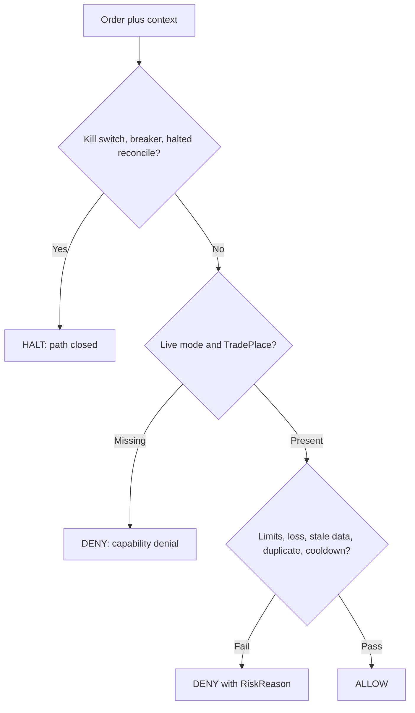

# Risk policy

Risk evaluation is deterministic: same order plus same context always
yields the same verdict. There is no network, no randomness, and no
dependency on MCP, strategy, transport, or storage.

## Gates

Live trading requires `live` mode together with
`TRADE` capability. Either one missing means denial. Withdrawal
requires the separate `WITHDRAW` capability and stays disabled
in the default policy.

## Deny reasons

Each denial carries a machine-readable `RiskReason`: order or position
size, daily loss, drawdown, cooldown, duplicate order, stale market or
account data, circuit breaker, kill switch, reconciliation failure,
capability denial, or invalid order. Agents branch on the reason code,
not on message text.

## Halt conditions

Kill switch, open circuit breaker, and halted reconciliation return
`HALT` instead of `DENY`. Halted means the trading path is closed until
an operator clears the condition.
