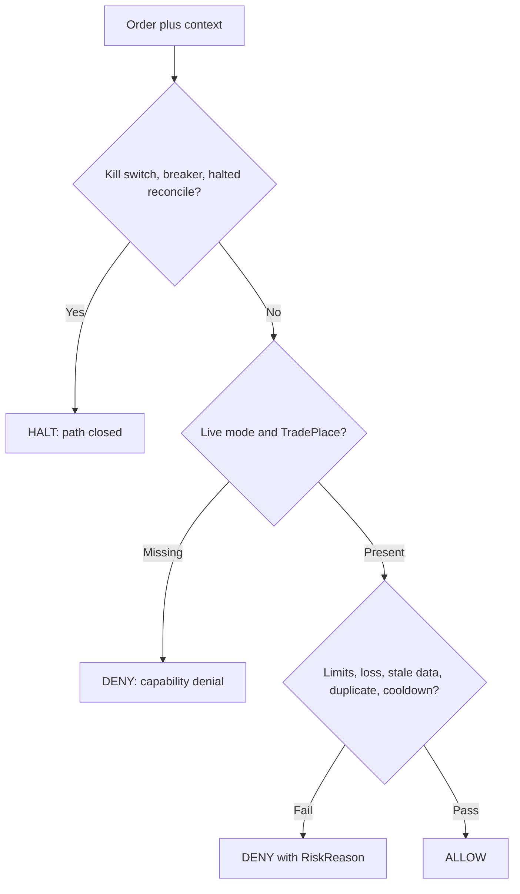

<h1 align="center">Risk policy</h1>

The risk engine is **deterministic and side-effect free**. It evaluates an order against a policy and a supplied runtime context.

## Current policy

The application currently uses paperOnlyPolicy:

~~~text
allowedModes = ["paper"]
allowedCapabilities = ["READ", "PAPER"]
killSwitch = false
circuitBreaker = false
~~~

This means the live execution branch is **not enabled by configuration alone**. The live adapter exists, but the composed policy **denies live mode**.

## Evaluation order

A failed rule produces a machine-readable `RiskReason`. Kill switch, circuit breaker, and reconciliation halt produce `HALT`; other rule failures produce `DENY`.

## Default limits

| Limit | Default |
| --- | ---: |
| Maximum order notional | 10,000,000 |
| Minimum order notional | 10,000 |
| Maximum position notional | 100,000,000 |
| Maximum daily loss | 5,000,000 |
| Maximum trade count | 100 |
| Order cooldown | 5,000 ms |
| Maximum market age | 60,000 ms |
| Maximum account age | 120,000 ms |

Financial limits use `Decimal`.

## Runtime limitation

The engine can evaluate all fields above, but **not every MCP entrypoint supplies authoritative runtime context**.

Some MCP paths use fixed freshness values and null daily PnL. Position exposure is optional and is **not populated by the current order tool context**.

Treat the risk engine as a **correct policy primitive**, not as proof that every caller supplies complete market, account, PnL, and position state.

## Denial semantics

Agents should branch on **reason codes** rather than message strings.

Examples include:

- LIVE_MODE_DENIED
- CAPABILITY_DENIED
- MIN_ORDER_SIZE
- MAX_ORDER_SIZE
- DAILY_LOSS_LIMIT
- MAX_POSITION_EXPOSURE
- COOLDOWN_ACTIVE
- STALE_MARKET_DATA
- STALE_ACCOUNT_STATE
- INSUFFICIENT_BALANCE

Risk evaluation is **not a network operation** and must remain **deterministic**.
