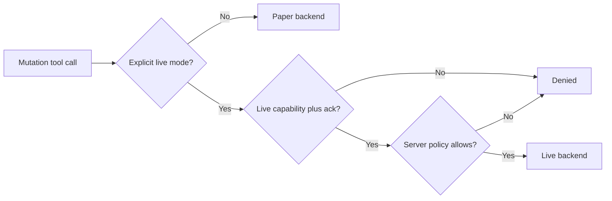

<h1 align="center">Trading modes</h1>

The repository models paper, live, and shadow execution modes. Paper is default. Live is gated by `APP_ENV=live` plus credentials, acknowledgement, and risk ALLOW.

## Current behavior

**Paper is the safe default.**

The indodax_paper_order flow builds a trade intent, creates an order proposal, runs risk review, and executes through ExecutionService into PaperExecutor.

The indodax_create_order tool routes paper requests into the same paper placement helper. Live requests need acknowledgement, APP_ENV live, credentials, and risk ALLOW, then execute via LiveExecutor.

## Live readiness boundary

The live adapter uses TAPI v2 signing. Live stays gated and needs credentials, acknowledgement, risk ALLOW, plus operational readiness below.

Before live execution can be enabled, the repository needs integrated proof for complete runtime risk context, durable state, exchange reconciliation, client-order idempotency, retry behavior for state-changing requests, private-order WebSocket handling, Deadman lifecycle integration, and end-to-end live-safe tests.

**Setting `APP_ENV=live` alone is not enough.** It also needs `TRADE_ENABLED=true`, credentials, acknowledgement, risk ALLOW, IP whitelist, and funds above minimums.

## Ambiguous outcomes

A timeout or dropped connection does not prove that an order failed.

The intended policy is:

1. preserve the client order identifier;
2. treat the result as unknown;
3. reconcile with the exchange;
4. only then determine whether another submission is safe.

The current transport helper still applies generic retries, so this policy is an architectural requirement that is not yet fully enforced across the complete live path.

## Withdrawal

Withdrawal is not a trading mode. The server exposes read-only funding information, but the withdrawal mutation is always denied.
