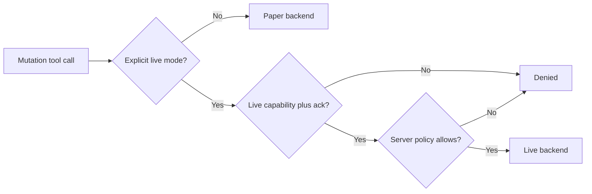

# Trading modes

Paper is the default. Every mutation tool assumes paper unless the
caller explicitly passes live mode with the matching capability and
acknowledgement, and the server policy still has the final word.

The pipeline is fixed: `TradingService` validates intents,
`RiskEngine` approves or denies, `ExecutionService` calls exactly one
backend. Unknown exchange outcomes (timeouts, dropped connections)
resolve through reconciliation before any retry, because a timeout is
not proof that the order failed.
