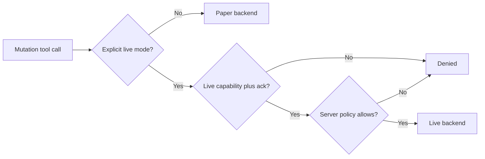
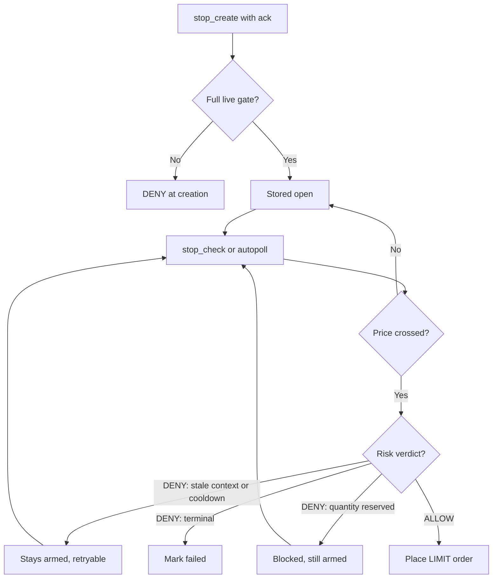

<h1 align="center">Trading modes</h1>

The repository models paper, live, and shadow execution modes. Paper is default. Live is gated by `APP_ENV=live` plus credentials, acknowledgement, and risk ALLOW. Shadow and development spellings are accepted by input schemas for forward compatibility but are **denied by server policy**: no policy enables them and no backend serves them, so any shadow or development request is denied rather than executed.

## What each mode is for

| Mode | Purpose | Executes anything? | State changes? | Requires |
| --- | --- | --- | --- | --- |
| `paper` | Simulation on a virtual ledger (100,000,000 IDR + 1 BTC). The default; use it for learning, testing, and automation dry runs | No exchange contact | Virtual ledger only | Nothing |
| `live` | Real orders on INDODAX through the same validation and risk pipeline | Yes, via `LiveExecutor` | Real exchange state | `APP_ENV=live` + `TRADE_ENABLED=true` + credentials + `acknowledged: true` + risk ALLOW, every call |
| `shadow` | Reserved for future shadow-trading (evaluate live signals without executing). Accepted by schemas so harnesses can pass it through, but no policy enables it today | No | Nothing | Always denied with `LIVE_MODE_DENIED` |
| `development` | Reserved for local development harnesses | No | Nothing | Always denied with `LIVE_MODE_DENIED` |

## Current behavior

**Paper is the safe default.**

The indodax_paper_order flow builds a trade intent, creates an order proposal, runs risk review, and executes through ExecutionService into PaperExecutor.

The indodax_create_order tool routes paper requests into the same paper placement helper. Live requests need acknowledgement, APP_ENV live, `TRADE_ENABLED=true`, credentials, and risk ALLOW, then execute via LiveExecutor.

Server-side stops trigger through the same gated path when `indodax_stop_check` runs, manually or on the opt-in `STOP_AUTOPOLL_MS` schedule. Live stop creation enforces the full live gate up front, so a stop can never be stored live while placement would be denied.

`retryable` and `blocked` are distinct from `failed` because a stop refused
for a refreshable reason, or because another order reserves the quantity, is
still armed protection. Retiring it would leave an open position with no
server-side downside protection while the report still showed an open stop.

## Live readiness boundary

The live adapter uses TAPI v2 signing. Every live call needs credentials, acknowledgement, risk ALLOW, plus IP whitelist and funds above minimums. DISARMED Deadman means no heartbeat protection; STALE or EXPIRED halts trading.

**Setting `APP_ENV=live` alone is not enough.** It also needs `TRADE_ENABLED=true`, credentials, acknowledgement, risk ALLOW, IP whitelist, and funds above minimums.

## Ambiguous outcomes

A timeout or dropped connection does not prove that an order failed.

The intended policy is:

1. preserve the client order identifier;
2. treat the result as unknown;
3. reconcile with the exchange;
4. only then determine whether another submission is safe.

State-changing requests attempt exactly once by default and opt into retries only with proven idempotency. A timeout or network failure after a live submission therefore surfaces as an explicit non-retryable unknown outcome (with the client order id preserved) instead of a blind duplicate. Reconciling with the exchange before any resubmission is still an operator responsibility.

## Withdrawal

Withdrawal is not a trading mode. The server exposes read-only funding information, but the withdrawal mutation is always denied.
